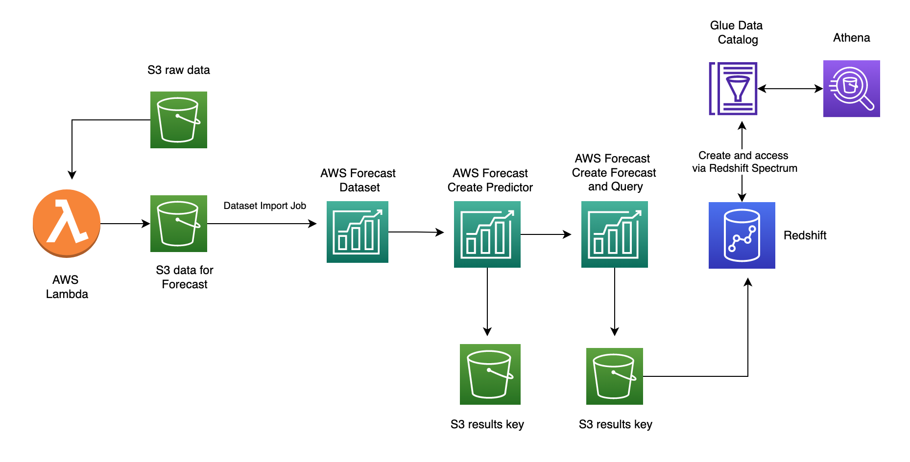
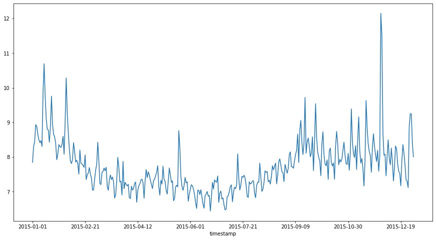

### AWS Forecast 

Forecast is a fully managed AWS service for time-series analysis. It can select from multiple time series prediction models to find the best one for your particular data sets.
Amazon Forecast  automatically examines the historical data provided (including any additional features that can impact the forecast), and identify what is meaningful, and produce 
a forecasting model capable of making highly accurate predictions.



Illustrating the use of AWS Forecasts service using the Manning Dataset. This is part of the [FbProphet Library](https://facebook.github.io/prophet/docs/quick_start.html#python-api)
example dataset which is a time series of the Wikipedia page hits for Peyton Manning. More details about the package 
can be found [here](https://peerj.com/preprints/3190/)

The code for the following exercise can be found [here](https://github.com/ryankarlos/AWS-ML-services/tree/master/projects/forecast) and 
configuring virtual environment with dependencies [here](https://github.com/ryankarlos/AWS-ML-services/blob/master/README.md#environment-and-dependencies)

Notebooks for the various steps described in the next sections can be found [here](https://github.com/ryankarlos/AWS-ML-services/blob/master/projects/forecast/notebooks/AWS_Forecast_automl.ipynb)
The notebook [AWS_Forecast.ipynb](https://github.com/ryankarlos/AWS-ML-services/blob/master/projects/forecast/notebooks/AWS_Forecast_automl.ipynb) uses the functions in the modules in this package to 
import data into S3, create an AWS forecast dataset and import data into it from S3, 
train a predictor and then forecast using the model. 

#### Data prep 

The functions in modules [prepare_data_for_s3.py](https://github.com/ryankarlos/AWS-ML-services/tree/master/projects/forecast/prepare_data_for_s3.py) filter the existing dataset to
only include historical data for one year (2015) and then reformat the dataset
to have columns ("timestamp", "target_value","item_id") and values as expected by AWS Forecast api.
Finally we call the s3 put object to add to created S3 bucket.

For illustration purposes and to generate the task viz, ive used dask delayed, but the dataset
size certainly does not warrant the need for it. 


The filtered raw data for 2015 which is imported into S3 and then imported into AWS forecast has the following
profile



Module [dataset_and_import_jobs.py](https://github.com/ryankarlos/AWS-ML-services/tree/master/projects/forecast/dataset_and_import_jobs.py) 
creates an AWS Forecast dataset group and dataset as described in AWS docs [1].
Here we only use target time series dataset type  The dataset group must include a target time series dataset which includes the 
target attribute (item_id) and timestamp attribute, as well as any dimensions. Related time series and Item metadata is optional [1]

For the data uploaded to S3 using module `prepare_data_for_s3.py`, the itemid column has been created and set to arbitary value (1) 
as all the items belong to the same group (i.e Manning's wikipedia hits)

The dataset group and import job can then be created using the snippet below after setting the data frequency for daily frequency and ts_schema.

```python
DATASET_FREQUENCY = "D"
ts_schema ={
   "Attributes":[
      {
         "AttributeName":"timestamp",
         "AttributeType":"timestamp"
      },
      {
         "AttributeName":"target_value",
         "AttributeType":"float"
      },
      {
         "AttributeName":"item_id",
         "AttributeType":"string"
      }
   ]
}
PROJECT = 'manning_ts'
DATA_VERSION = 1
dataset_name = f"{PROJECT}_{DATA_VERSION}"
dataset_arn = create_dataset(dataset_name, DATASET_FREQUENCY, ts_schema)
dataset_group_arn = create_dataset_group_with_dataset(dataset_name, dataset_arn)
```

We then create an import job to import the time series dataset from s3 into AWS forecast dataset
so it is ready for training. After creating the import job - we can check for job status before 
progressing to the training step


```python
bucket_name = 'aws-forecast-demo-examples'
key = "manning_ts_2015.csv"
ts_dataset_import_job_response = create_import_job(bucket_name, key, dataset_arn, role_arn)
dataset_import_job_arn=ts_dataset_import_job_response['DatasetImportJobArn']
check_job_status(dataset_import_job_arn, job_type="import_data")
```


#### Model Training

Create a predictor (an Amazon Forecast model) that is trained using the target time series. 
You can use predictors to generate forecasts based on your time-series data.

Amazon Forecast requires the  Dataset group, Forecast frequency and Forecast horizon inputs when training a predictor [2]
Hence these are passed into the custom functions for creating the predictor, with the following settings:

* Dataset group (defined previously)
* Forecast frequency – The granularity of your forecasts (in this case daily).
* Forecast horizon – The number of time steps being forecasted (in this case,
  set this to 35 days)
  
This custom function calls the forecast.create_predictor method and sets the AutoML parameter to _True_. 
However, this can also be upgraded to AutoPredictor and is suggested by AWS as the preferred method, since the predictors 
created are more accurate compared with those created via manual selection [2]. AutoPredictor achieves this by selecting the 
optimal combination of models for the time series in the dataset.


```python
FORECAST_LENGTH = 35
DATASET_FREQUENCY = "D"
predictor_name = f"{PROJECT}_{DATA_VERSION}_automl"
create_predictor_response , predictor_arn = train_aws_forecast_model(predictor_name, FORECAST_LENGTH, DATASET_FREQUENCY, dataset_group_arn)
check_job_status(predictor_arn, job_type="training")
```


### Backtest results

Amazon Forecast uses backtesting to compute metrics, for evaluating predictors. Some of these are listed below, along with the
common use cases for applying each one [3].

|Metric | Definition |When to use | equation |
| :----:|:--------:|:----------:| :----------:|
| Root Mean Square Error(RMSE)| square root of the average of squared errors. It is sensitive to large deviations (outliers) between the actual demand and forecasted values.|Useful in cases when you want to penalise outliers where a few large incorrect predictions from a model on some items can be very costly to the business. For sparse datasets where demand for items in historical data is low, it would be better to use WAPE or wQL instead as RMSE will not account for scale of total demand|$\frac{n}{T} \Sigma_{i,t}({y_{i,t}}-\hat{y_{i,t}})^2$ |
| Weighted Quantile Loss (wQL)| measures accuracy of a model at a specified quantile. An extension of this is the Average wQL metric which is the mean of wQL values for all quantiles (forecast types) selected during predictor creation. |wQL is particularly useful when there are different costs for underpredicting and overpredicting. By setting the weight of the wQL function, you can automatically incorporate differing penalties for underpredicting and overpredicting. The Average wQL can be used for evaluating forecasts at multiple quantiles together.| $2\frac{\Sigma_{i,t}[\tau\max(y_{i,t} - q_{i,t}^{(\tau)}, 0) + (1-\tau)\max(q_{i,t}^{(\tau)} - y_{i,t}, 0)]}{\Sigma_{i,t}\left\| y_{i,t} \right\|}$ |                                    
|Mean Absolute Scaled Error (MASE)|divides the average error by a scaling factor which is dependent on the seasonality value, that is selected based on the forecast frequency. MASE is a scale-free metric, which makes it useful for comparing models from different datasets. MASE values can be used to meaningfully compare forecast error across different datasets regardless of the scale of total demand. |ideal for datasets that are cyclical in nature or have seasonal properties. e.g. forecasting for products that are in high demand in summer compared to winter| $\frac{\frac{1}{J} \Sigma_{j}( \left\| {e_{j}} \right\|)}{\frac{1}{T-m} \Sigma_{t=m+1}^{T}( \left\| {Y_{t} - {Y_{t-m}}} \right\|)} $ |
|Mean Absolute Percentage Error(MAPE)|percentage difference of the mean forecasted and actual value) averaged over all time points.  The normalization in the MAPE allows this metric to be compared across datasets with different scales.|useful for datasets where forecasting errors need to be emphasised equally on all items regardless of demand. It also equally penalizes for under-forecasting or over-forecasting, so useful metric to use when the difference in costs of under-forecasting or over-forecasting is negligible|$\frac{1}{n} \Sigma_{i,t} \left\| \frac{A_{t} - F_{t}}{A_{t}} \right\| $ |
|Weighted absolute percentage error(WAPE)|sum of the absolute error normalized by the total demand. A high total demand results in a low WAPE and vice versa.The weighting allows these metrics to be compared across datasets with different scales.|useful in evaluating datasets that contain a mix of items with large and small demand. A retailer may want to prioritise forecasting errrors for standard items with high sales compared to special edition items which are sold infrequently. WAPE would be a good choice in such a case. For sparse datasets where a large proportion of products are sold infrequently (i.e. demand is 0 for most of the historical data), WAPE would be a better choice compared to RMSE as it accounts for the total scale of demand.| $\frac{ \Sigma_{i,t}({y_{i,t}}-\hat{y_{i,t}})^2}{\Sigma_{i,t}({y_{i,t}}})$|


The metrics are provided for each backtest window specified. For multiple backtest windows, the metrics are averaged across
all the windows. The user can adjust the backtest window length (testing set) and the number of backtests (can vary from 1 to 5) 
when training a predictor [3]. However, the backtest window length must be at least as large as the prediction window or forecast horizon 
(this is the default setting if not overriden by the user). It also cannot exceed more that half the length of 
the entire time series. The metrics are computed from the forecasted values and observed values during backtesting. Missing values 
which are filled in the dataset using one of the AWS forecast supported methods [4], are not used when computing the metrics as they are not classed as observed values [3].


```
error_metrics = evaluate_backtesting_metrics(predictor_arn)
```


and to plot the backtest results for all metrics except 
Weighted Quantile Losses.

Looking at the results, seems like NPTS is the winning algorithm
followed by Deep AR Plus. 
So AWS Forecast, will use the NPTS model for serving forecasts

We can also see MASE metric better highlights the difference in
performance between various algorithms as it is more suited to
this dataset due to cyclical/seasonal properties in data

```python
plot_backtest_metrics(error_metrics)
```


#### Forecast and query

Now we have a trained model so we can create a forecast. This
includes predictions for every item (item_id) in the dataset group 
that was used to train the predictor [5]

```python
forecast_name = f"{PROJECT}_{DATA_VERSION}_automl_forecast"
forecast_arn = create_forecast(forecast_name, predictor_arn)
```


Once this is done, we can then query the forecast by passing a filter (key-value pair),
where the key/values are one of the schema attribute names and valid values respectively. 
This will return forecast for only those items that satisfy the criteria [5].
In this case, we query the forecast and return all the items 
by using the item id dimension

```python
filters = {"item_id":"1"}
forecast_response = run_forecast_query_and_plot(forecast_arn, filters)
df = create_forecast_plot(forecast_response)

```


#### Terminating resources

Finally we can tear down all the AWS Forecast resources: predictor, forecast and 
dataset group 

```python
kwargs = {'forecast':forecast_name,
'predictor':predictor_name
}
delete_training_forecast_resources(**kwargs)
```


## References 

1. Importing datasets https://docs.aws.amazon.com/forecast/latest/dg/howitworks-datasets-groups.html
2. Training Predictors https://docs.aws.amazon.com/forecast/latest/dg/howitworks-predictor.html
3. Predictor metrics and backtesting https://docs.aws.amazon.com/forecast/latest/dg/metrics.html
4. Handling missing values https://docs.aws.amazon.com/forecast/latest/dg/howitworks-missing-values.html
5. Generating and Querying forecasts https://docs.aws.amazon.com/forecast/latest/dg/howitworks-forecast.html
