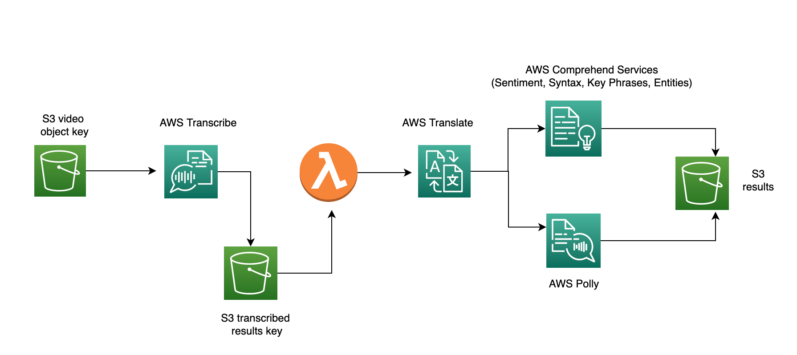

## AWS NLP services

This section will focus on pipelines combining the following AWS services:

* AWS Transcribe: automatic speech recognition (speech to text)
* AWS Polly: Convert text to life like speech
* AWS Translate: Translate text from one lang to another
* AWS Comprehend: Analysis of text data e.g. sentiment analysis, POS tagging, key phrases, entity detection

### Use Case 1 - Translating Video speech to another language and analysing sentiment and key-words in speech



The mp3 file we want to use is in `datasets/nlp/source/transcribe-sample.5fc2109bb28268d10fbc677e64b7e59256783d3c.mp3`
and is just some english speech about ML. 
we first need to create a bucket in S3 `awstestnlp` and then copy this data over, either via console or using cli

``
$ aws s3 cp datasets/nlp/source/transcribe-sample.mp3 s3://awstestnlp/source/transcribe-sample.mp3
``


For the next sections, first make sure you have activated virtual env added
repo root to pythonpath

```
$ export PYTHONPATH=.
$ pipenv shell

Warning: Your Pipfile requires python_version 3.10, but you are using 3.9.1 (/Users/rk1103/.local/share/v/A/bin/python).
  $ pipenv --rm and rebuilding the virtual environment may resolve the issue.
  $ pipenv check will surely fail.
Launching subshell in virtual environment...
 . /Users/rk1103/.local/share/virtualenvs/AWS-ML-services-sGYPpasX/bin/activate
```

#### deploying lambda function 


We will first need to create a lambda function with packaged code in lambdas/parses3json. This parses the json from s3 
(returned  from AWS Transcription jon step in the state machine) and returns the output to the next stage for further 
NLP processing by other AWS services


Then run the following command

```

$ python lambdas/deploy_lambda_function.py --function_name parses3json
 
{
    "ResponseMetadata": {
        "RequestId": "8f272d31-ea01-4b3f-a34b-1e523dc4539d",
        "HTTPStatusCode": 201,
        "HTTPHeaders": {
            "date": "Thu, 12 May 2022 22:55:16 GMT",
            "content-type": "application/json",
            "content-length": "999",
            "connection": "keep-alive",
            "x-amzn-requestid": "8f272d31-ea01-4b3f-a34b-1e523dc4539d"
        },
        "RetryAttempts": 0
    },
    "FunctionName": "parses3json",
    "FunctionArn": "arn:aws:lambda:us-east-1:376337229415:function:parses3json",
    "Runtime": "python3.9",
    "Role": "arn:aws:iam::376337229415:role/service-role/ReadObjectsS3forLambda",
    "Handler": "lambda_function.lambda_handler",
    "CodeSize": 372,
    "Description": "",
    "Timeout": 20,
    "MemorySize": 128,
    "LastModified": "2022-05-12T22:55:16.473+0000",
    "CodeSha256": "6Q14hDxyn8Eh9eXqxo9jhEka8I4wcAH302TxUMOww1s=",
    "Version": "$LATEST",
    "TracingConfig": {
        "Mode": "PassThrough"
    },
    "RevisionId": "e574f385-0982-4b22-846b-a6ea0ac6a485",
    "State": "Pending",
    "StateReason": "The function is being created.",
    "StateReasonCode": "Creating",
    "PackageType": "Zip",
    "Architectures": [
        "x86_64"
    ],
    "EphemeralStorage": {
        "Size": 512
    }
}

```

Currently, this assumes we have a role named "ReadObjectsS3forLambda" for lambda resource to assume. If we need to
change this, we can pass in an additional parameter. Also, timeout defaults to 20 secs. This can also be overwritten

```
$ python lambdas/deploy_lambda_function.py --function_name parses3json --role "NewLambdaRole" --timeout 150
```

#### Step Function Execution

Before creating and executing the Step Functions workflows, first need to grant Step Functions workflow 
(state machine) permissions to trigger Lambda functions via IAM role as below. Here I have attached a number 
of AWS managed policies to the role to allow access to translate, comprehend, polly, transcribe, 
comprehend services and S3,lambda etc


If creating new step function, the create_state_machine() method of boto sfn client requires the
Amazon States Language definition of the state machine in string format
the https://boto3.amazonaws.com/v1/documentation/api/latest/reference/services/stepfunctions.html#SFN.Client.create_state_machine asl_definition 

This is defined in the json file `step_functions/AWSNLPServicesdefinition.json`, which is loaded and converted to
json string format.
This may need to be adapted depending if the lambda function to be executed has a different name/arn

To create and execute the step function run the following command. This will first deploy the step function and attach role
'StepFunctionAWSNLPServices', with step function name 'NLPExecution'.
Once deployed the step function will execute and translate the source mp3 video (default lang 'en-us') to spanish (set by
`--target_lang_code`). This needs to be paired with a voice-id for the chosen target language, required by AWS Polly  
https://docs.aws.amazon.com/polly/latest/dg/voicelist.html

```
$ python projects/nlp/execute_pipeline.py --sf_name NLPExecution --target_lang_code es --voice_id Lupe --deploy --role StepFunctionAWSNLPServices

Deploying step function:

{
    "stateMachineArn": "arn:aws:states:us-east-1:376337229415:stateMachine:NLPExecution", 
    "creationDate": "2022-05-13 03:13:49.982000+01:00", 
    "ResponseMetadata": {
        "RequestId": "10cea0a5-1a75-4d31-b59c-527e78fcb566", 
        "HTTPStatusCode": 200, 
        "HTTPHeaders": {
            "x-amzn-requestid": "10cea0a5-1a75-4d31-b59c-527e78fcb566",
             "date": "Fri, 13 May 2022 02:13:50 GMT",
              "content-type": "application/x-amz-json-1.0",
               "content-length": "117"
        }, 
        "RetryAttempts": 0
    }
}

waiting for 30 secs for deployment to complete and state function in active state

Step function NLPExecution is active with resource arn: arn:aws:states:us-east-1:376337229415:stateMachine:NLPExecution

Executed state machine NLPExecution:
 {
    "executionArn": "arn:aws:states:us-east-1:376337229415:execution:NLPExecution:9f572dda-0707-4851-b5c9-21496931b874",
    "startDate": "2022-05-13 03:47:00.646000+01:00",
    "ResponseMetadata": {
        "RequestId": "7cdd8471-670f-42ad-8f6b-1a9a95b610fe",
        "HTTPStatusCode": 200,
        "HTTPHeaders": {
            "x-amzn-requestid": "7cdd8471-670f-42ad-8f6b-1a9a95b610fe",
            "date": "Fri, 13 May 2022 02:47:00 GMT",
            "content-type": "application/x-amz-json-1.0",
            "content-length": "145"
        },
        "RetryAttempts": 0
    }
}

Execution status is 'RUNNING', waiting 10 secs before checking status again
Execution status is 'RUNNING', waiting 10 secs before checking status again
Execution status is 'RUNNING', waiting 10 secs before checking status again
Execution status is 'RUNNING', waiting 10 secs before checking status again
Job succeeded !

```

If step function is already created and we just want to execute, run the following command. This will translate the video
to spanish.

```
$ python projects/nlp/execute_pipeline.py --sf_name NLPExecution --target_lang_code es --voice_id Lupe --no-deploy
```


The input to the state machine is computed in the code in `execute_pipeline.py` and is passed 
in the following format for this execution


````
{
  "BucketName": "awstestnlp",
  "Source": "s3://awstestnlp/source/en-US/transcribe-sample.mp3",
  "TranscribeOutputKey": "transcribe/es/transcribed.json",
  "PollyVideoOutputKey": "polly/es/Lupe/",
  "PollyResponseOutputKey": "polly/es/response.json",
  "ComprehendOutputKey": "comprehend/es/text_analysis.json",
  "SourceLanguageCode": "en-US",
  "TargetLanguageCode": "es",
  "JobName": "Test",
  "VoiceId": "Lupe",
  "EngineType": "neural",
  "SkipComprehend": false
}
````

We can see from the flow below, that depending on the engine type detected, the input will go to the 
respective task to execute - which sets the engine parameter to 'neural' or 'standard' depending on the
voice id chosen from this list https://docs.aws.amazon.com/polly/latest/dg/voicelist.html.
Also, there is another choice task to determine whether to skip the comprehend step if the language is not one of 
the following (de", "pt","en","it","fr","es") as the others are not supported by all the services e.g. syntax detection
It uses the $.SkipComprehend state variable which is part of the input passed to the state machine (above) and computed
in the code in `execute_pipeline.py`


The following execution translates to French using voice id 'Mathieu'. This is a standard engine and 
the flow passes it ot the appropriate task. Since French is supported by all comprehend services, the parallel block
is executed.

```
$ python projects/nlp/execute_pipeline.py --sf_name NLPExecution --target_lang_code fr --voice_id Mathieu --no-deploy
```


This execution  translates to Japanese using voice id 'Takumi'. This is a neural engine. However, the language is
not supported by all the AWS Comprehend services used in the state machine and hence the choice task will skip this


```
$ python projects/nlp/execute_pipeline.py --sf_name NLPExecution --target_lang_code ja --voice_id Takumi --no-deploy
```


#### Copying results to local 

To copy all the contents of the s3 bucket `awstetsnlp` to local `datasets\nlp` folder

````
$ aws s3 cp s3://awstestnlp datasets/nlp --recursive

download: s3://awstestnlp/polly/text_to_speech.mp3.0ec1ff34-318e-4d1b-a43e-5d9cb7760a4c.mp3 to datasets\nlp\polly\text_to_speech.mp3.0ec1ff34-318e-4d1b-a43e-5d9cb7760a4c.mp3
download: s3://awstestnlp/polly/text_to_speech.mp3.4e6bad27-9766-4209-a533-c4c665f4de25.mp3 to datasets\nlp\polly\text_to_speech.mp3.4e6bad27-9766-4209-a533-c4c665f4de25.mp3
download: s3://awstestnlp/polly/text_to_speech.mp3.46fa196c-150b-48f0-9e3a-6930b7e52322.mp3 to datasets\nlp\polly\text_to_speech.mp3.46fa196c-150b-48f0-9e3a-6930b7e52322.mp3
download: s3://awstestnlp/polly/text_to_speech.mp3.22e4f400-406b-4db3-a6da-5292565a35a2.mp3 to datasets\nlp\polly\text_to_speech.mp3.22e4f400-406b-4db3-a6da-5292565a35a2.mp3
download: s3://awstestnlp/polly/text_to_speech.mp3.20bacd74-abf6-4215-99e2-d140d745c419.mp3 to datasets\nlp\polly\text_to_speech.mp3.20bacd74-abf6-4215-99e2-d140d745c419.mp3
download: s3://awstestnlp/polly/text_to_speech.mp3.0278c082-1fb4-4ed3-9fba-cc3100d49b1a.mp3 to datasets\nlp\polly\text_to_speech.mp3.0278c082-1fb4-4ed3-9fba-cc3100d49b1a.mp3
download: s3://awstestnlp/polly/text_to_speech.mp3.5af307bf-4be1-47a6-a48b-f26a402e7c65.mp3 to datasets\nlp\polly\text_to_speech.mp3.5af307bf-4be1-47a6-a48b-f26a402e7c65.mp3
download: s3://awstestnlp/polly/test.json.a8cc5b40-a0ec-4815-b3c7-f5f1cb6d9166.mp3 to datasets\nlp\polly\test.json.a8cc5b40-a0ec-4815-b3c7-f5f1cb6d9166.mp3
download: s3://awstestnlp/polly/text_to_speech.mp3.bfb4d484-4c41-4766-9d7a-6cde7ad64f49.mp3 to datasets\nlp\polly\text_to_speech.mp3.bfb4d484-4c41-4766-9d7a-6cde7ad64f49.mp3
download: s3://awstestnlp/polly/text_to_speech.mp3.7263a0dd-5c9f-4328-9f0b-d051fe375a13.mp3 to datasets\nlp\polly\text_to_speech.mp3.7263a0dd-5c9f-4328-9f0b-d051fe375a13.mp3
download: s3://awstestnlp/transcribed/.write_access_check_file.temp to datasets\nlp\transcribed\.write_access_check_file.temp
download: s3://awstestnlp/polly/text_to_speech.mp3.cddebc19-8cbb-4d97-bea0-84b3349778d6.mp3 to datasets\nlp\polly\text_to_speech.mp3.cddebc19-8cbb-4d97-bea0-84b3349778d6.mp3
download: s3://awstestnlp/polly/text_to_speech.mp3.d341979e-4a93-4c12-ae82-d2af7493ad9c.mp3 to datasets\nlp\polly\text_to_speech.mp3.d341979e-4a93-4c12-ae82-d2af7493ad9c.mp3
download: s3://awstestnlp/transcribed/test.json to datasets\nlp\transcribed\test.json
download: s3://awstestnlp/polly/text_to_speech.mp3.f4b0bc05-a932-42f0-b547-dfb41e362fa3.mp3 to datasets\nlp\polly\text_to_speech.mp3.f4b0bc05-a932-42f0-b547-dfb41e362fa3.mp3
download: s3://awstestnlp/polly/text_to_speech.mp3.ffb6858e-aee5-4dc3-9591-846e4b4515a3.mp3 to datasets\nlp\polly\text_to_speech.mp3.ffb6858e-aee5-4dc3-9591-846e4b4515a3.mp3
download: s3://awstestnlp/polly/text_to_speech.mp3.f17b0367-0f92-4dfc-9c04-ce625a8f5fae.mp3 to datasets\nlp\polly\text_to_speech.mp3.f17b0367-0f92-4dfc-9c04-ce625a8f5fae.mp3
download: s3://awstestnlp/polly/text_to_speech.mp3.d4cb7f7e-25bf-40a9-b78c-a92cb926df4e.mp3 to datasets\nlp\polly\text_to_speech.mp3.d4cb7f7e-25bf-40a9-b78c-a92cb926df4e.mp3
download: s3://awstestnlp/source/transcribe-sample.5fc2109bb28268d10fbc677e64b7e59256783d3c.mp3 to datasets\nlp\source\transcribe-sample.5fc2109bb28268d10fbc677e64b7e59256783d3c.mp3
download: s3://awstestnlp/transcribed/transcribed.json to datasets\nlp\transcribed\transcribed.json
download: s3://awstestnlp/polly/text_to_speech.mp3.f6247047-127b-457d-bed0-f82070fe695c.mp3 to datasets\nlp\polly\text_to_speech.mp3.f6247047-127b-457d-bed0-f82070fe695c.mp3
```
