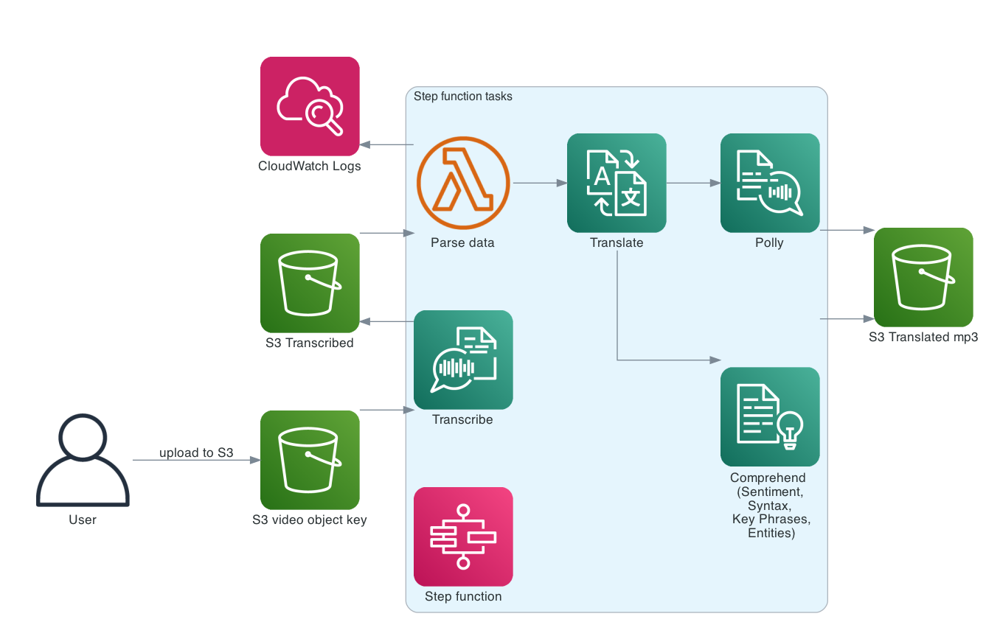

## AWS NLP services

This demo will focus on pipelines combining the following AWS service for translating 
video speech and analysing sentiment and key-words in speech.

* AWS Transcribe: automatic speech recognition (speech to text)
* AWS Polly: Convert text to life like speech
* AWS Translate: Translate text from one lang to another
* AWS Comprehend: Analysis of text data e.g. sentiment analysis, POS tagging, key phrases, entity detection 
  
The architecture diagram for this workflow is shown below. An mp3 file will be uploaded to S3 and a step function 
workflow will execute tasks listed above to transcribe, translate and convert text back to speech, which will be stored in
mp3 format in S3. We will also invoke a lambda function as one of the tasks to parse the transcribed data so 
it is in the required format for the downstream tasks. Outputs from most of the tasks will stored in S3, whilst lambda
logs will automatically stored in cloudwatch logstream.

The code for the following exercise can be found in the github repository [here](https://github.com/ryankarlos/AWS-ML-services) and
For the next sections, we need to install the dependencies in the [pipfile](https://github.com/ryankarlos/AWS-ML-services/blob/master/Pipfile)
by following the instructions [here](https://github.com/ryankarlos/AWS-ML-services/blob/master/README.md)
  
The environment can then be activated by running the following commands from the root of the repository.

```shell
$ export PYTHONPATH=.
$ pipenv shell
```

### Loading data into S3

The mp3 file we want to use is stored [here](https://github.com/ryankarlos/AWS-ML-services/blob/master/datasets/nlp/source/transcribe-sample.mp3)
and is just some speech in english about Machine Learning. We first need to create a bucket in S3 `awstestnlp` and then copy this data over, either via console or using cli
as below

``shell
$ aws s3 cp datasets/nlp/source/transcribe-sample.mp3 s3://awstestnlp/source/transcribe-sample.mp3
``

The architecture diagram shows a lambda function  being invoked after the AWS transcribe is called to parse the 
output of the transcribed data stored in S3. The parsed data will then be passed to the next stage in the state machine for 
further analysis by other AWS services. In the next section we will deploy the code to lambda function for 
parsing the data.

### Deploying lambda function 


We will first need to create a lambda function containing the following handler.

```python
import json
import boto3

def lambda_handler(event, context):
    s3 = boto3.resource("s3")
    obj = s3.Object(event["BucketName"], event["TranscribeOutputKey"]).get()
    big_str = json.loads(obj["Body"].read().decode("utf-8"))
    transcribed_text = big_str["results"]["transcripts"][0]["transcript"]
    print(transcribed_text)
    return {"TranscribedText": transcribed_text}
```

To deploy the lambda, we can either do this directly in the console or by using [zip archives](https://docs.aws.amazon.com/lambda/latest/dg/python-package.html) with no
dependencies. The following [script](https://github.com/ryankarlos/AWS-ML-services/blob/master/lambdas/deploy_lambda_function.py) from the base of the repository
creates a zip archive and deploys the function code to lambda. 


```python
import boto3
import shutil
import json
import click
from pathlib import Path
import os

iam_client = boto3.client("iam")
lambda_client = boto3.client("lambda")


@click.command()
@click.option("--function_name", help="Name of lambda resource to create")
@click.option(
    "--role", default="ReadObjectsS3forLambda", help="IAM role name for lambda resource"
)
@click.option("--timeout", default=20, help="Max allowable timeout for lambda")
def create_lambda_aws(
    function_name, role, timeout, handler="lambda_function.lambda_handler"
):
    os.chdir(Path(__file__).parent)
    shutil.make_archive(function_name, "zip", function_name)
    with open(f"{function_name}.zip", "rb") as f:
        lambda_zip = f.read()

    role = iam_client.get_role(RoleName=role)
    print(f"\n Role details: {json.dumps(role, default=str)} \n")

    response = lambda_client.create_function(
        FunctionName=function_name,
        Runtime="python3.9",
        Role=role["Role"]["Arn"],
        Handler=handler,
        Code=dict(ZipFile=lambda_zip),
        Timeout=timeout,  # Maximum allowable timeout
    )

    print(json.dumps(response, indent=4, default=str))


if __name__ == "__main__":
    create_lambda_aws()
```

The script above also assumes we have a [Lambda execution role](https://github.com/ryankarlos/AWS-ML-services/blob/master/iam/roles/ReadObjectsS3forLambda) 
already created to include a policy to peform s3:GetObject action in the S3 bucket and log to Cloudwatch.

```
{
    "Version": "2012-10-17",
    "Statement": [
        {
            "Effect": "Allow",
            "Action": "logs:CreateLogGroup",
            "Resource": "arn:aws:logs:us-east-1:376337229415:*"
        },
        {
            "Effect": "Allow",
            "Action": [
                "logs:CreateLogStream",
                "logs:PutLogEvents"
            ],
            "Resource": [
                "arn:aws:logs:us-east-1:376337229415:log-group:/aws/lambda/parseS3json:*"
            ]
        },
        {
            "Effect": "Allow",
            "Action": [
                "s3:GetObject"
            ],
            "Resource": "arn:aws:s3:::*"
        }
    ]
}
```

By default, it uses a role named "ReadObjectsS3forLambda" for the lambda resource to assume. If we need to
change this, we can pass in an additional parameter, when running this via the cli. If doing this
via the console, just select the correct execution role. The timeout setting defaults to 20 seconds, which can also 
be overwritten by passing the argument in the cli (from the console, this can be set directly to a maximum 
of 15 minutes)

```shell
$ python lambdas/deploy_lambda_function.py --function_name parses3json --role "NewLambdaRole" --timeout 150
```

### Step Function Execution

Before creating and executing the Step Functions workflows, first need to grant Step Functions workflow 
(state machine) permissions to trigger Lambda functions via IAM role as below. Here I have attached a number 
of AWS managed policies to the role to allow access to translate, comprehend, polly, transcribe, 
comprehend services and S3,lambda etc


If creating new step function, the `create_state_machine` method of boto sfn client requires the
Amazon States Language definition of the state machine in string format as described [here](https://boto3.amazonaws.com/v1/documentation/api/latest/reference/services/stepfunctions.html#SFN.Client.create_state_machine)
This is already defined in the [json file]((https://github.com/ryankarlos/AWS-ML-services/blob/master/step_functions/AWSNLPServicesdefinition.json), which is loaded and converted to
json string format. This may need to be adapted depending if the lambda function to be executed has a different name/arn
We also create a role (in this case named 'StepFunctionAWSNLPServices') for the Step Function to orchestrate the NLP services and Lambda.

To create and execute the step function, execute the [script](https://github.com/ryankarlos/AWS-ML-services/blob/master/projects/nlp/execute_pipeline.py) from the command line as below. This will first deploy the step 
function and attach role 'StepFunctionAWSNLPServices', with step function name 'NLPExecution'. This script will use the state machine definition from file named 
[AWSNLPServicesdefinition.json](https://github.com/ryankarlos/AWS-ML-services/blob/master/step_functions/AWSNLPServicesdefinition.json). Once deployed the step function will execute and translate the source mp3 video (default lang 'en-us') to spanish (set by
`--target_lang_code`). This needs to be paired with a voice-id for the chosen target language, required by AWS Polly 
(see [AWS docs] for voice id choices (https://docs.aws.amazon.com/polly/latest/dg/voicelist.html)).
This will translate the video to spanish based on the target language specified.


```shell
$ python projects/nlp/execute_pipeline.py --sf_name NLPExecution --target_lang_code es --voice_id Lupe --deploy --role StepFunctionAWSNLPServices

Deploying step function:

{
    "stateMachineArn": "arn:aws:states:us-east-1:376337229415:stateMachine:NLPExecution", 
    "creationDate": "2022-05-13 03:13:49.982000+01:00", 
    "ResponseMetadata": {
        "RequestId": "10cea0a5-1a75-4d31-b59c-527e78fcb566", 
        "HTTPStatusCode": 200, 
        "HTTPHeaders": {
            "x-amzn-requestid": "10cea0a5-1a75-4d31-b59c-527e78fcb566",
             "date": "Fri, 13 May 2022 02:13:50 GMT",
              "content-type": "application/x-amz-json-1.0",
               "content-length": "117"
        }, 
        "RetryAttempts": 0
    }
}

waiting for 30 secs for deployment to complete and state function in active state

Step function NLPExecution is active with resource arn: arn:aws:states:us-east-1:376337229415:stateMachine:NLPExecution

Executed state machine NLPExecution:
 {
    "executionArn": "arn:aws:states:us-east-1:376337229415:execution:NLPExecution:9f572dda-0707-4851-b5c9-21496931b874",
    "startDate": "2022-05-13 03:47:00.646000+01:00",
    "ResponseMetadata": {
        "RequestId": "7cdd8471-670f-42ad-8f6b-1a9a95b610fe",
        "HTTPStatusCode": 200,
        "HTTPHeaders": {
            "x-amzn-requestid": "7cdd8471-670f-42ad-8f6b-1a9a95b610fe",
            "date": "Fri, 13 May 2022 02:47:00 GMT",
            "content-type": "application/x-amz-json-1.0",
            "content-length": "145"
        },
        "RetryAttempts": 0
    }
}

Execution status is 'RUNNING', waiting 10 secs before checking status again
Execution status is 'RUNNING', waiting 10 secs before checking status again
Execution status is 'RUNNING', waiting 10 secs before checking status again
Execution status is 'RUNNING', waiting 10 secs before checking status again
Job succeeded !
```

The input payload to the state machine execution above is automatically passed in the following format 
when the script [execute_pipeline.py](https://github.com/ryankarlos/AWS-ML-services/blob/master/projects/nlp/execute_pipeline.py) is run.
````
{
  "BucketName": "awstestnlp",
  "Source": "s3://awstestnlp/source/en-US/transcribe-sample.mp3",
  "TranscribeOutputKey": "transcribe/es/transcribed.json",
  "PollyVideoOutputKey": "polly/es/Lupe/",
  "PollyResponseOutputKey": "polly/es/response.json",
  "ComprehendOutputKey": "comprehend/es/text_analysis.json",
  "SourceLanguageCode": "en-US",
  "TargetLanguageCode": "es",
  "JobName": "Test",
  "VoiceId": "Lupe",
  "EngineType": "neural",
  "SkipComprehend": false
}
````

If the step function is already created, we can execute it by passing the --no-deploy argument to the command above. 

```shell
$ python projects/nlp/execute_pipeline.py --sf_name NLPExecution --target_lang_code es --voice_id Lupe --no-deploy
```


We can see from the flow below, that depending on the engine type detected, the input will go to the 
respective task to execute - which sets the engine parameter to 'neural' or 'standard' depending on the
voice id chosen from [this](https://docs.aws.amazon.com/polly/latest/dg/voicelist.html)list 
Also, there is another choice task to determine whether to skip the comprehend step if the language is not one of 
the following (de", "pt","en","it","fr","es") as the others are not supported by all the services e.g. syntax detection
It uses the $.SkipComprehend state variable which is part of the input passed to the state machine (above) and computed
in the code in `execute_pipeline.py`


The following execution translates to French using voice id 'Mathieu'. This is a standard engine and 
the flow passes it ot the appropriate task. Since French is supported by all comprehend services, the parallel block
is executed.

```shell
$ python projects/nlp/execute_pipeline.py --sf_name NLPExecution --target_lang_code fr --voice_id Mathieu --no-deploy
```


This execution  translates to Japanese using voice id 'Takumi'. This is a neural engine. However, the language is
not supported by all the AWS Comprehend services used in the state machine and hence the choice task will skip this

```shell
$ python projects/nlp/execute_pipeline.py --sf_name NLPExecution --target_lang_code ja --voice_id Takumi --no-deploy
```


### Copying results to local 

To copy all the contents of the s3 bucket `awstetsnlp` to a local foldes 

```shell
$ aws s3 cp s3://awstestnlp datasets/nlp --recursive
```

The outputs of the steps from step functions can be accessed in this [folder](https://github.com/ryankarlos/AWS-ML-services/tree/master/datasets/nlp)
including the translations of speech in different languages [here](https://github.com/ryankarlos/AWS-ML-services/tree/master/datasets/nlp/polly) 