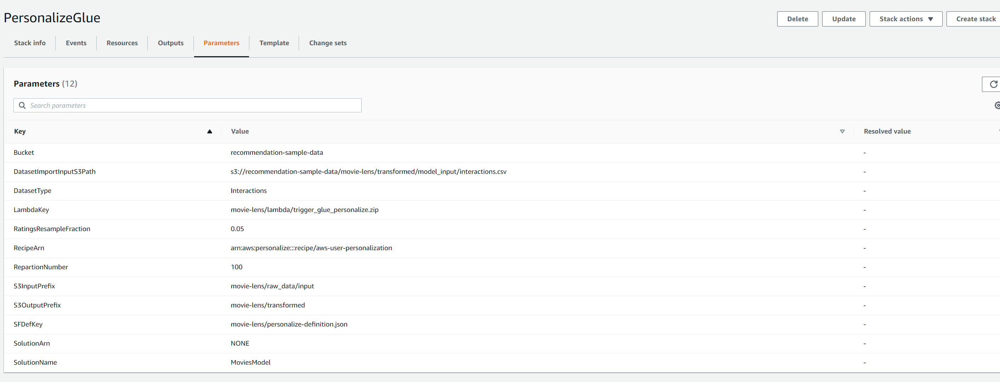
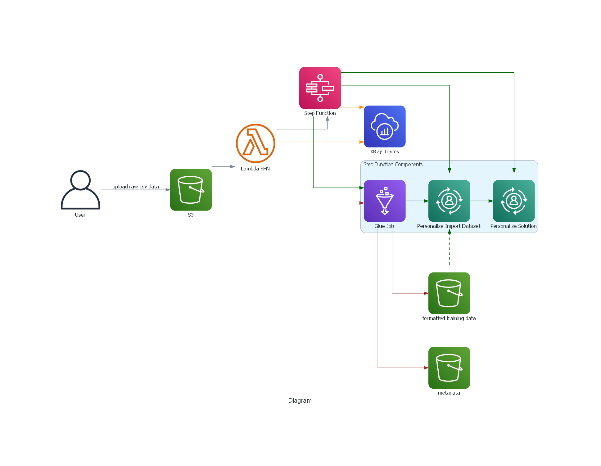

# AWS Personalize

Amazon Personalize allows developers with no prior machine learning experience to easily build sophisticated personalization capabilities into their applications. 
With Personalize, you provide an activity stream from your application, as well as an inventory of the items you want to recommend, and Personalize will process 
the data to train a personalization model that is customized for your data.

In this tutorial, we will be using the [MovieLens dataset](https://movielens.org/) which is a popular dataset used for recommendation research.
Download the zip [MovieLens 25M Dataset](https://grouplens.org/datasets/movielens/) under **Recommended for new research** section
From command line, we can unzip this as below. Navigate to the folder where the zip is stored and run the unzip comand.
You may need to install the unzip package if not already installed from this [link](https://www.tecmint.com/install-zip-and-unzip-in-linux/). 
For example on ubuntu `sudo apt-get install -y unzip`.
We do not require the _genome-tags.csv_ and _genome-scores.csv_ so these can be deleted

```
$ cd datasets/personalize
$ unzip ml-25m.zip
Archive:  datasets/personalize/ml-25m.zip
   creating: ml-25m/
  inflating: ml-25m/tags.csv
  inflating: ml-25m/links.csv
  inflating: ml-25m/README.txt
  inflating: ml-25m/ratings.csv
  inflating: ml-25m/genome-tags.csv
  inflating: ml-25m/genome-scores.csv
  inflating: ml-25m/movies.csv

```

## Loading data into S3 

For this tutorial, we will be using the full 25m MovieLens dataset (25 million ratings and one million tag applications applied to 62,000 movies by 162,000 users).
This can result in a large bill when training a personalize solution, depending on the recipe used (> $100).
So either one could sample a smaller dataset from this or use the MovieLens Latest Datasets recommended for education and development, which is a lot smaller
(100,000 ratings and 3,600 tag applications applied to 9,000 movies by 600 users)

The following example sets Status=Enabled to enable Transfer Acceleration on a bucket. You use Status=Suspended to suspend Transfer Acceleration.

```
$ aws s3api put-bucket-accelerate-configuration --bucket recommendation-sample-data --accelerate-configuration Status=Enabled
```

It's a best practice to use aws s3 commands (such as aws s3 cp) for multipart uploads and downloads, because these aws s3 commands automatically perform multipart uploading and downloading based on the file size
as described in [AWS docs](https://aws.amazon.com/premiumsupport/knowledge-center/s3-multipart-upload-cli/)
To use more of your host's bandwidth and resources during the upload, increase the maximum number of concurrent requests set in your AWS CLI configuration. By default, the AWS CLI uses 10 maximum concurrent requests. 
This command sets the maximum concurrent number of requests to 20:

You can direct all Amazon S3 requests made by s3 and s3api AWS CLI commands to the accelerate endpoint: s3-accelerate.amazonaws.com. To do this, set the configuration value use_accelerate_endpoint to true in a profile 
in your AWS Config file. Transfer Acceleration must be enabled on your bucket to use the accelerate endpoint.
The following example uploads a file to a bucket enabled for Transfer Acceleration by using the --endpoint-url parameter to specify the accelerate endpoint.

```
$ aws configure set default.s3.use_accelerate_endpoint true
$ aws configure set default.s3.max_concurrent_requests 20
$ aws s3 cp datasets/personalize/ml-25m/ s3://recommendation-sample-data/movie-lens/raw_data/ --region us-east-1 --recursive --endpoint-url https://recommendation-sample-data.s3-accelerate.amazonaws.com


upload: datasets\personalize\ml-25m\links.csv to s3://recommendation-sample-data/movie-lens/links.csv
upload: datasets\personalize\ml-25m\input\movies.csv to s3://recommendation-sample-data/movie-lens/movies.csv
upload: datasets\personalize\ml-25m\README.txt to s3://recommendation-sample-data/movie-lens/README.txt
upload: datasets\personalize\ml-25m\tags.csv to s3://recommendation-sample-data/movie-lens/tags.csv
upload: datasets\personalize\ml-25m\input\ratings.csv to s3://recommendation-sample-data/movie-lens/ratings.csv

```


Finally we need to add the glue script and lambda function to S3 bucket as well. This assumes the lambda function is zipped 
as in `lambdas/data_import_personalize.zip` and you have a bucket with key `aws-glue-assets-376337229415-us-east-1/scripts`. If not adapt
the query accordingly. Run the following commands from root of the repo

```
$ aws s3 cp step_functions/personalize-definition.json s3://recommendation-sample-data/movie-lens/personalize-definition.json
$ aws s3 cp lambdas/trigger_glue_personalize.zip s3://recommendation-sample-data/movie-lens/lambda/trigger_glue_personalize.zip
```

If you have not configured transfer acceleration for the default glue assets bucket, then you can set to false before running `cp` command as below.
Otherwise, you will get the following error: *An error occurred (InvalidRequest) when calling the PutObject operation: S3 Transfer Acceleration is not configured on this bucket*

```
$ aws configure set default.s3.use_accelerate_endpoint false
$ aws s3 cp projects/personalize/glue/Personalize_Glue_Script.py s3://aws-glue-assets-376337229415-us-east-1/scripts/Personalize_Glue_Script.py
```

## CloudFormation Templates

The cloudformation template for creating the resources for this example is located in this [folder](https://github.com/ryankarlos/AWS-ML-services/tree/master/cloudformation)
More details on cloudformation can be found [here](../../cloudformation), which contains links to the appropriate AWS docs.
The cloudformation template `personalize.yaml` creates the following resources:

* Glue Job 
* Personalize resources (Dataset, DatasetGroup, Schema) and associated role 
* Step Function (for running ETL and Personalize DatasetImport Job and Creating solution version) and associated role
* lambda function (and associated role) for triggering step function execution with S3 event notification.

We can use the following cli command to create the template, with the path to the template passed to the `--template-body`
argument. Adapt this depending on where your template is stored. We also need to include the `CAPABILITIES_NAMED_IAM` value to 
`--capabilities` arg as the template includes IAM resources e.g. IAM role which has a custom name such as a RoleName

```
 $ aws cloudformation create-stack --stack-name PersonalizeGlue \
 --template-body file://cloudformation/personalize.yaml \
 --capabilities CAPABILITY_NAMED_IAM

{
    "StackId": "arn:aws:cloudformation:<region>:<account-id>:stack/PersonalizeGlue/2dc9cca0-fe63-11ec-b51b-0e44449cc4eb"
}

```

If successful, we should see the following resources successfully created in the resources tab



If we run the command as above, just using the default parameters, we should see the key value pairs listed in the parameters
tab as in screenshot below.


We should see that all the services should be created. For example navigate to the Step function console and click on the 
sfn name `GlueETLPersonalizeTraining`


## S3 event notifications

We need to configure S3 event notifications for train and prediction workflows:

* **Training workflow**
- S3 to lambda notification (for put raw data object event) to trigger the step function execution for the train workflow

* **Batch/RealTime Recommendations**
1. S3 to Lambda notification for triggering Personalize Batch Job when batch sample data object but into S3 bucket prefix
2. S3 to Lambda notification for triggering lambda to transform output of batch job added to S3. 
3. S3 notification to SNS topic, when the output of lambda transform lands in S3 bucket. We have configured email as subscriber 
to SNS via protocol set as email endpoint, via cloudformation. The SNS messages will then send email to subscriber 
address when event message received from S3.

To add bucket event notification for starting the training workflow via step functions, run the custom script and 
passing arg `--workflow` with value `train`. By default, this will send S3 event when csv file is uploaded into 
`movie-lens/batch/results/` prefix in the bucket.

```
$ python projects/personalize/put_notification_s3.py --workflow train

INFO:botocore.credentials:Found credentials in shared credentials file: ~/.aws/credentials
INFO:__main__:Lambda arn arn:aws:lambda:........:function:LambdaSFNTrigger for function LambdaSFNTrigger
INFO:__main__:HTTPStatusCode: 200
INFO:__main__:RequestId: X6X9E99JE13YV6RH
```

To add bucket event notification for batch/realtime predictions run the script and pass `--workflow` with value `predict`.
The default prefixes set for the object event triggers for s3 to lambda and s3 to sns notification, can be found in the [source
code](https://github.com/ryankarlos/AWS-ML-services/blob/master/projects/personalize/put_notification_s3.py). 
These can be overridden by passing the respective argument names (see click options in the[source code](https://github.com/ryankarlos/AWS-ML-services/blob/master/projects/personalize/put_notification_s3.py)).

```
$ python projects/personalize/put_notification_s3.py --workflow predict

INFO:botocore.credentials:Found credentials in shared credentials file: ~/.aws/credentials
INFO:__main__:Lambda arn arn:aws:lambda:us-east-1:376337229415:function:LambdaBatchTrigger for function LambdaBatchTrigger
INFO:__main__:Lambda arn arn:aws:lambda:us-east-1:376337229415:function:LambdaBatchTransform for function LambdaBatchTransform
INFO:__main__:Topic arn arn:aws:sns:us-east-1:376337229415:PersonalizeBatch for PersonalizeBatch
INFO:__main__:HTTPStatusCode: 200
INFO:__main__:RequestId: Q0BCATSW52X1V299
```

**Note**: There is currently not support for notifications to FIFO type SNS topics. 

## Trigger Workflow for Training Solution



The lambda function and step function resources in the workflow should already be created via cloudformation. 
We will trigger the workflow, by uploading the raw dataset into S3 path, for which S3 event notification is configured to
trigger lambda and invoke the function. This will execute the state machine, which will run all the steps defined in the definition file


Firstly, it run the glue job to transform the  raw data to required schema and format for importing interactions dataset into personalize. 
https://docs.aws.amazon.com/personalize/latest/dg/interactions-dataset-requirements.html
The outputs from the glue job are stored in a different S3 folder to the raw data. 


It will then import the interactions dataset into the personalize. A custom dataset group resource and interactions dataset (with ) already created and defined,
when creating the cloudformation stack.


Wait for solution version to print an ACTIVE status. Training can take a while, depending on the dataset size and number of user-item
interactions. If using AutoMl this can take longer. Be careful, that the training time (hrs) value is  based on 1 hr of compute capacity 
(default is 4CPU and 8GiB memory). However, this can be automatically adjusted if more efficient instance type is chosen to 
train the data in order to complete the job more quickly. In this case, the training hours metric computed will be adjusted and increased , 
resulting in a larger bill.

To diagnose any faults in execution, we can look at the x ray traces and logs. You can now view the service map within the Amazon CloudWatch console. Open the CloudWatch console 
and choose Service map under X-Ray traces from the left navigation pane.  The service map indicates the health of each node by coloring it based on the ratio of successful calls to errors and faults.
Each AWS resource that sends data to X-Ray appears as a service in the graph. Edges connect the services that work together to serve requests [Ref](https://docs.aws.amazon.com/xray/latest/devguide/xray-concepts.html)
In the center of each node, the console shows the average response time and number of traces that it sent per minute during the chosen time range. 
A trace collects all the segments generated by a single request.

Choose a service node to view requests for that node, or an edge between two nodes to view requests that traversed that connection. The service map disassociates the workflow into
two trace ids, for every request, with the following groups of segments:

* lambda service and function segments
* step function, glue, personalize segments


You can also choose a trace ID to view the trace map and timeline for a trace.  The Timeline view shows a hierarchy of segments and subsegments. The first entry in 
the list is the segment, which represents all data recorded by the service for a single request.
Below the segment are subsegments. This example shows subsegments recorded by Lambda segments. Lambda records a segment for the Lambda service that handles the invocation 
request, and one for the work done by the function [Ref](https://docs.aws.amazon.com/lambda/latest/dg/services-xray.html). The function segment comes with subsegments for Initialization phase (Lambda execution environment is initialised), 
Invocation phase (function handler is invoked) and Overhead phase (dwell time between sending the response and the signal for the next invoke).


For step functions, we can see the various subsegments corresponding to the different states in the state machine.


### Run GlueJob via Notebook and Train Solution Manually

Create GlueDev endpoint using [CloudFormation stack](https://github.com/ryankarlos/AWS-ML-services/blob/master/cloudformation/glue-dev-endpoint.yaml)
Instructions on using cloudformation can be found [here](../../cloudformation)

Set the parameters 
* NumberofWorkers = 7
* WorkerType = G.1X

Then create notebook using this endpoint and upload the [notebook](https://github.com/ryankarlos/AWS-ML-services/blob/master/projects/personalize/glue/notebook/Personalize_GLue.ipynb)

Once the notebook has finished running, you should see two folders in `s3://recommendation-sample-data/movie-lens/transformed/` as below. 
Each of these will contain a csv file corresponding to the interactions data (which will be used for training solution) and 
additional metadata (i.e. columns with movie genres, ratings etc)

**Note**: The notebook by default samples half the number of rows in the ratings csv which is still around 12.5 million rows.
This can result in a large bill if training a model (as mentioned in previous section).
You may want to adjust the fraction parameter to sample method, to a lower value (e.g. 0.05) and check the ratings 
dataframe row count afterwards.

```
resampledratings_dyf = DynamicFrame.fromDF(
    S3inputratings_node1656882568718.toDF().sample(False, 0.5, seed=0),
    glueContext,
    "resampled ratings",
)


resampledratings_dyf.toDF().count()
```


We can then import dataset into personalize by running the following script:

```
$ python projects/personalize/import_dataset.py --dataset_arn arn:aws:personalize:us-east-1:376337229415:dataset/RecommendGroup/INTERACTIONS --role_arn arn:aws:iam::376337229415:role/PersonalizeRole
Dataset Import Job arn: arn:aws:personalize:us-east-1:376337229415:dataset-import-job/MoviesDatasetImport
Name: MoviesDatasetImport
ARN: arn:aws:personalize:us-east-1:376337229415:dataset-import-job/MoviesDatasetImport
Status: CREATE PENDING
```

From the AWS console, create a training solution. Go to Solutions and Recipes -> Create Solution and fill in the 
values as in the screenshot below and then click `Create and train solution`

* Solution name: PersonalizeModel
* Solutiontype: Item recommendation
* Recipe: aws-user-personalization
* Advanced Configuration - Turn on 'Perform HPO'. Leave the other parameter values as it is.

The User-Personalization (aws-user-personalization) recipe is optimized for all User_Personalization recommendation scenarios. 
When recommending items, this recipe uses automatic item exploration [Ref](https://docs.aws.amazon.com/personalize/latest/dg/native-recipe-new-item-USER_PERSONALIZATION.html)


## Evaluating solution metrics 

You can use offline metrics to evaluate the performance of the trained model before you create a campaign and provide recommendations. 
Offline metrics allow you to view the effects of modifying a solution's hyperparameters or compare results from models trained with the same data.
[Ref](https://docs.aws.amazon.com/personalize/latest/dg/working-with-training-metrics.html)
To get performance metrics, Amazon Personalize splits the input interactions data into a training set and a testing set. The split depends on the type of recipe you choose:
For USER_SEGMENTATION recipes, the training set consists of 80% of each user's interactions data and the testing set consists of 20% of each user's interactions data.
For all other recipe types, the training set consists of 90% of your users and their interactions data. The testing set consists of the remaining 10% of users and their interactions data.
Amazon Personalize then creates the solution version using the training set. After training completes, Amazon Personalize gives the new solution version the oldest 90% of each user’s 
data from the testing set as input. Amazon Personalize then calculates metrics by comparing the recommendations the solution version generates to the actual interactions in the 
newest 10% of each user’s data from the testing set [Ref](https://docs.aws.amazon.com/personalize/latest/dg/working-with-training-metrics.html)


You retrieve the metrics for a the trained solution version above, by running the following script, which calls the GetSolutionMetrics operation with  
`solutionVersionArn` parameter

```shell
python projects/personalize/evaluate_solution.py --solution_version_arn <solution-version-arn>

2022-07-09 20:31:24,671 - evaluate - INFO - Solution version status: ACTIVE
2022-07-09 20:31:24,787 - evaluate - INFO - Metrics:

 {'coverage': 0.1233, 'mean_reciprocal_rank_at_25': 0.1208, 'normalized_discounted_cumulative_gain_at_10': 0.1396, 'normalized_discounted_cumulative_gain_at_25': 0.1996, 'normalized_discounted_cumulative_gain_at_5': 0.1063, 'precision_at_10': 0.0367, 'precision_at_25': 0.0296, 'precision_at_5': 0.0423}
```

The above metrics are described below :

**coverage**
An evaluation metric that tells you the proportion of unique items that Amazon Personalize might recommend using your model 
out of the total number of unique items in Interactions and Items datasets. To make sure Amazon Personalize recommends more of your items, 
use a model with a higher coverage score. Recipes that feature item exploration, such as User-Personalization, have higher coverage than those that 
don’t, such as popularity-count [Ref](https://docs.aws.amazon.com/personalize/latest/dg/working-with-training-metrics.html)
**mean reciprocal rank at 25**
An evaluation metric that assesses the relevance of a model’s highest ranked recommendation. Amazon Personalize calculates this metric 
using the average accuracy of the model when ranking the most relevant recommendation out of the top 25 recommendations over all requests for recommendations.
This metric is useful if you're interested in the single highest ranked recommendation [Ref](https://docs.aws.amazon.com/personalize/latest/dg/working-with-training-metrics.html)
**normalized discounted cumulative gain (NCDG) at K (5/10/25)**
An evaluation metric that tells you about the relevance of your model’s highly ranked recommendations, where K is a sample size of 5, 10, or 25 recommendations. 
Amazon Personalize calculates this by assigning weight to recommendations based on their position in a ranked list, where each recommendation is 
discounted (given a lower weight) by a factor dependent on its position. The normalized discounted cumulative gain at K assumes that recommendations that 
are lower on a list are less relevant than recommendations higher on the list.
Amazon Personalize uses a weighting factor of 1/log(1 + position), where the top of the list is position 1.
This metric rewards relevant items that appear near the top of the list, because the top of a list usually draws more attention.[Ref](https://docs.aws.amazon.com/personalize/latest/dg/working-with-training-metrics.html)
**precision at K**
An evaluation metric that tells you how relevant your model’s recommendations are based on a sample size of K (5, 10, or 25) recommendations. 
Amazon Personalize calculates this metric based on the number of relevant recommendations out of the top K recommendations, divided by K, 
where K is 5, 10, or 25. This metric rewards precise recommendation of the relevant items [Ref](https://docs.aws.amazon.com/personalize/latest/dg/working-with-training-metrics.html)

  
## Creating Campaign for realtime recommendations

A campaign is a deployed solution version (trained model) with provisioned dedicated transaction capacity for creating 
real-time recommendations for your application users.  After you complete Preparing and importing data and Creating a solution, you are ready to 
deploy your solution version by creating an AWS Personalize Campaign [Ref](https://docs.aws.amazon.com/personalize/latest/dg/campaigns.html)
If you are getting batch recommendations, you don't need to create a campaign.

```shell
$ python projects/personalize/deploy_solution.py --campaign_name MoviesCampaign --sol_version_arn <solution_version_arn> --mode create

2022-07-09 21:12:08,412 - deploy - INFO - Name: MoviesCampaign
2022-07-09 21:12:08,412 - deploy - INFO - ARN: arn:aws:personalize:........:campaign/MoviesCampaign
2022-07-09 21:12:08,412 - deploy - INFO - Status: CREATE PENDING
```

An additional arg `--config` can be passed, to set the **explorationWeight** and **explorationItemAgeCutOff** parameters for the user
personalizaion recipe [Ref](https://docs.aws.amazon.com/personalize/latest/dg/native-recipe-new-item-USER_PERSONALIZATION.html#bandit-hyperparameters)
These parameters default to 0.3 and 30.0 respectively if not passed (as in previous example)
To set the explorationWeight and ItemAgeCutoff to 0.6 and 100 respectively, run the script as below:

```shell
$ python projects/personalize/deploy_solution.py --campaign_name MoviesCampaign --sol_version_arn <solution_version_arn> \
--config "{\"itemExplorationConfig\":{\"explorationWeight\":\"0.6\",\"explorationItemAgeCutOff\":\"100\"}}" --mode create

2022-07-09 21:12:08,412 - deploy - INFO - Name: MoviesCampaign
2022-07-09 21:12:08,412 - deploy - INFO - ARN: arn:aws:personalize:........:campaign/MoviesCampaign
2022-07-09 21:12:08,412 - deploy - INFO - Status: CREATE PENDING
```

## Recommendations


With the User-Personalization recipe, Amazon Personalize generates scores for items based on a user's interaction data and metadata. 
These scores represent the relative certainty that Amazon Personalize has in whether the user will interact with the item next. 
Higher scores represent greater certainty.[Ref](https://docs.aws.amazon.com/personalize/latest/dg/recommendations.html)

Amazon Personalize scores all the items in your catalog relative to each other on a scale from 0 to 1 (both inclusive), so that the total of 
all scores equals 1. For example, if you're getting movie recommendations for a user and there are three movies in the Items dataset, 
their scores might be 0.6, 0.3, and 0.1. Similarly, if you have 1,000 movies in your inventory, the highest-scoring movies might have very 
small scores (the average score would be.001), but, because scoring is relative, the recommendations are still valid.[Ref](https://docs.aws.amazon.com/personalize/latest/dg/recommendations.html)


To get batch recommendations, you use a batch inference job. A batch inference job is a tool that imports your batch input data from an Amazon 
S3 bucket, uses your solution version to generate item recommendations, and then exports the recommendations to an Amazon S3 bucket.
The input data can be a list of users or items or list of users each with a collection of items in JSON format. Use a batch inference 
job when you want to get batch item recommendations for your users or find similar items across an inventory.

To get user segments, you use a batch segment job. A batch segment job is a tool that imports your batch input data from an Amazon
S3 bucket, uses your solution version trained with a USER_SEGMENTATION recipe to generate user segments for each row of input 
data, and exports the segments to an Amazon S3 bucket. Each user segment is sorted in descending order based on the probability that 
each user will interact with items in your inventory. [Ref](https://docs.aws.amazon.com/personalize/latest/dg/recommendations-batch.html)

The input data in S3 needs to be a json file with the data in a specific format as specified [here](https://docs.aws.amazon.com/personalize/latest/dg/batch-data-upload.html#batch-recommendations-json-examples)
For this example we will use a sample as in `datasets\personalize\ml-25m\batch\input\users.json` and upload this to S3 bucket `recommendation-sample-data` in
`movie-lens/batch/input/users.json`.

### Batch Job 

The cloudformation  stack created earlier, should have deployed the necessary resources to 
run the batch job, i.e a lambda function which gets triggered when input data is added to S3, and creates the 
batch job in Personalize. The lambda function will automatically trigger either a batch segment job 
or a batch inference job depending on the filename. A `users.json` file, is assumed to have user ids for which
we required item recommendations and will trigger a batch inference job using the solution version arn specified 
as the lambda environment variable (defined through the cloudformation stack parameters) . We will be using the
solution version trained using the USER_PERSONALIZATION recipe, in the previous section

An `items.json` file on the other hand, will trigger a batch segment job, and should be of the
format as in `datasets/personalize/ml-25m/batch/input/items.json`. This will return a list of users with
highest probabilites for recommending the items to.
**Note**: A batch segment job requires the solution to be trained with a USER_SEGMENTATION recipe and will
throw an error if another recipe is used. This will require training a new solution with this recipe and 
is beyond the scope of this tutorial.
The lambda config should look as below with the event trigger set as S3.


A second lambda function which runs a transform operation when the  results from the batch job are added to S3 from Personalize. If successful, a notification is sent to SNS topic
configured with email as endpoint to send alert when the workflow completes. 
The output of the batch job from personalize, returns a json in the following format:

```
{"input":{"userId":"1"},"output":{"recommendedItems":[....],"scores":[....]},"error":null}
{"input":{"userId":"2"},"output":{"recommendedItems":[....],"scores":[...]},"error":null}
......
.....
```

With the transformation, we intend to return a structured dataset serialised in parquet format (with snappy compression),
with the following schema:

* **userID**: integer
* **Recommendations**: string

The movie id is mapped to the title and associated genre and release year or each user as below . Each recommendation
is separated by a `|` delimiter.

```
   userId                           Recommendations
0    1       Movie Title (year) (genre) | Movie Title (year) (genre) | ....
1    2       Movie Title (year) (genre) | Movie Title (year) (genre) | ....
......

```

This also uses a lambda layer with the AWS managed DataWrangler layer, so the pandas and numpy libraries are available. 
The configuration, should look like below, with the lambda layer and destination as SNS.

To trigger the batch inference job workflow, copy the sample `users.json` batch data to s3 path below.

```shell
aws s3 cp datasets/personalize/ml-25m/batch/input/users.json s3://recommendation-sample-data/movie-lens/batch/input/users.json
```
This creates a batch inference job with the job name having the unixtimestamp affixed to the end.

We should receive a notification via email, when the entire workflow completes. 
The outputs of the batch job and subsequent transformation, should be visible 
in the bucket with keys `movie-lens/batch/results/inference/users.json.out` and 
`movie-lens/batch/results/inference/transformed.parquet` respectively.
These have also been copied and stored in the repo in `datasets/personalize/ml-25m/batch/results/users.json.out`
and `datasets/personalize/ml-25m/batch/results/transformed.parquet`

```
    userId                                    Recommendations
0    15000  Kiss the Girls (1997) (Crime) | Scream (1996) ...
1   162540  Ice Age 2: The Meltdown (2006) (Adventure) | I...
2     5000  Godfather, The (1972) (Crime) | Star Wars: Epi...
3       94  Jumanji (1995) (Adventure) | Nell (1994) (Dram...
4     4638  Inglourious Basterds (2009) (Action) | Watchme...
5     9000  Die Hard 2 (1990) (Action) | Lethal Weapon 2 (...
6      663  Crow, The (1994) (Action) | Nightmare Before C...
7     1030  Sister Act (1992) (Comedy) | Lethal Weapon 4 (...
8     3384  Ocean's Eleven (2001) (Crime) | Matrix, The (1...
9    34567  Lord of the Rings: The Fellowship of the Ring,...
10      50  Grand Budapest Hotel, The (2014) (Comedy) | He...
11   80000  Godfather: Part II, The (1974) (Crime) | One F...
12  110000  Manhattan (1979) (Comedy) | Raging Bull (1980)...
13      13  Knocked Up (2007) (Comedy) | Other Guys, The (...
14   20000  Sleepless in Seattle (1993) (Comedy) | Four We...
```

### Real-Time Recommendations

You can also get real-time recommendations from Amazon Personalize with a campaign created earlier to give movie recommendations.
To increase recommendation relevance, include contextual metadata for a user, such as their device type or the time of day, 
when you get recommendations or get a personalized ranking [Ref](https://docs.aws.amazon.com/personalize/latest/dg/getting-real-time-recommendations.html)

The API Gateway integration with lambda backend, should already be configured if cloudformation was run successfully.
We have configured the method request to accept a querystring parameter *user_id* and defined model schema.
An API method can be integrated with Lambda using one of two [integration methods](https://docs.aws.amazon.com/apigateway/latest/developerguide/set-up-lambda-integrations.html),
*Lambda proxy integration* or *Lambda non-proxy (custom) integration*. By default, we used [Lambda Proxy Integration](https://docs.aws.amazon.com/apigateway/latest/developerguide/set-up-lambda-proxy-integrations.html) 
in cloudformation template *personalize_predict.yaml*, which allows the client to call a single lambda function in the backend. When a client submits a request, API Gateway sends the raw request to lambda 
without necessarily preserving the order of the parameters. This request data includes the request headers, query string parameters, URL path variables, payload, and API configuration 
data [Ref](https://docs.aws.amazon.com/apigateway/latest/developerguide/set-up-lambda-proxy-integrations.html).
We could also use [Lambda non-proxy integration](https://docs.aws.amazon.com/apigateway/latest/developerguide/set-up-lambda-custom-integrations.html)  by setting the template parameter *APIGatewayIntegrationType* 
to AWS. The difference to the Proxy Integration method is that in addition, we also need to configure a mapping template to map the incoming request data  to the integration request, 
as required by the backend Lambda function. In the cloudformation template *personalize_predict.yaml*, this is already predefined in the *RequestTemplates* property of the *ApiGatewayRootMethod* resource, 
which  translates the user_id query string parameter to the user_id property of the JSON payload. This is necessary because input to a Lambda function in the Lambda function must be expressed in the body. 
However, as the default type is set to *AWS_PROXY*, the mapping template is ignored as it is not required.


The API endpoint URL to be invoked should be visible from the console, under the stage tab.


The API can be tested by opening a browser and typing the URL  into a browser address bar along with the querystring parameters. 
For example: *https://knmel67a1g.execute-api.us-east-1.amazonaws.com/dev?user_id=5*

For monitoring, we have also configured API gateway to send traces to XRay and logs to Cloudwatch.
Since the API is integrated with a single lambda function, you will see nodes in the service map containing information about the overall time spent and other performance
metrics in the API Gateway service, the Lambda service, and the Lambda function. The timeline shows the hierarchy of segments and subsegments.  Further details on 
request/response times and faults/errors can be found by clicking on each segment/subsegment in the timeline.
For more information refer to [AWS docs](https://docs.aws.amazon.com/apigateway/latest/developerguide/apigateway-using-xray-maps.html)


### Running in Local Mode

We can run the recommendations locally using custom scripts in the repo. 
For **real time recommendations**, run the following script, passing in the solution version arn, campaign arn, role name, user id and setting 
recommendation mode to realtime. So for user `1`, the model recommends movies of drama/romance theme.

```shell
python projects/personalize/recommendations.py --job_name Moviesrealtimerecommend --sol_arn <solution-arn> --role_name PersonalizeRole \
--campaign_arn <campaign-arn> --user_id 1 --recommendation_mode realtime
```

|Bad Education (La mala educaci▒n) (2004)| (Drama|Thriller)|
|Eternal Sunshine of the Spotless Mind (2004)| (Drama|Romance|Sci-Fi)|
|Nobody Knows (Dare mo shiranai) (2004)| (Drama)|
|Good bye, Lenin! (2003)| (Comedy|Drama)|
|Man Without a Past, The (Mies vailla menneisyytt▒) (2002)| (Comedy|Crime|Drama)|
|Amelie (Fabuleux destin d'Am▒lie Poulain, Le) (2001)| (Comedy|Romance)|
|Talk to Her (Hable con Ella) (2002)| (Drama|Romance)|
|Motorcycle Diaries, The (Diarios de motocicleta) (2004)| (Adventure|Drama)|
|Very Long Engagement, A (Un long dimanche de fian▒ailles) (2004)| (Drama|Mystery|Romance|War)|
|In the Mood For Love (Fa yeung nin wa) (2000)| (Drama|Romance)|


User `40` has been recommended crime/drama themed movies.


|Kill Bill: Vol. 2 (2004)| (Action|Drama|Thriller)|
Little Miss Sunshine (2006)| (Adventure|Comedy|Drama)|
|Snatch (2000)| (Comedy|Crime|Thriller)|
|There Will Be Blood (2007)| (Drama|Western)|
|Last King of Scotland, The (2006)| (Drama|Thriller)|
|Trainspotting (1996)| (Comedy|Crime|Drama)|
|Mystic River (2003)| (Crime|Drama|Mystery)|
|No Country for Old Men (2007)| (Crime|Drama)|
|Sin City (2005)| (Action|Crime|Film-Noir|Mystery|Thriller)|
|Platoon (1986)| (Drama|War)|


User `162540` is interesting and seems to have recommended a combination of children/comedy and action/thriller 
genre movies based on users interactions.


|Ice Age 2: The Meltdown (2006)| (Adventure|Animation|Children|Comedy)|
|I Am Legend (2007)| (Action|Horror|Sci-Fi|Thriller|IMAX)|
|Shrek the Third (2007)| (Adventure|Animation|Children|Comedy|Fantasy)|
|2 Fast 2 Furious (Fast and the Furious 2, The) (2003)| (Action|Crime|Thriller)|
|Saw II (2005)| (Horror|Thriller)|
|300 (2007)| (Action|Fantasy|War|IMAX)|
|Fight Club (1999)| (Action|Crime|Drama|Thriller)|
|Night at the Museum (2006)| (Action|Comedy|Fantasy|IMAX)|
|Dark Knight, The (2008)| (Action|Crime|Drama|IMAX)|
|Hancock (2008)| (Action|Adventure|Comedy|Crime|Fantasy)|


We can also limit the number of results by passing in value for arg `--num_results`, which defaults to 10.
So for example, for `--user_id 15000` , we can get the top 4 results   


|Kiss the Girls (1997)| (Crime|Drama|Mystery|Thriller)|
|Scream (1996)| (Comedy|Horror|Mystery|Thriller)|
|Firm, The (1993)| (Drama|Thriller)|
|Wild Things (1998)| (Crime|Drama|Mystery|Thriller)|


For **Batch Inference jobs**, we need to run the `projects/personalize/recommendations.py` script.
This uses the default s3 bucket name `recommendation-sample-data` and input data key `movie-lens/batch/input/users.json`.
These can be overridden by passing a value to the `--bucket` and `--batch_input_key` args respectively. The results output will be stored in `movie-lens/batch/results/`
but a different path can be chosen by passing a path to `--batch_results_key` arg.

```shell
$ python projects/personalize/recommendations.py --job_name BatchInferenceMovies --num_results 25 --sol_arn arn:aws:personalize:.........:solution/PersonalizeModel/03c184cc --role_name PersonalizeRole
2022-07-10 05:50:55,409 - recommendations - INFO - Running batch inference job BatchInferenceMovies with config: {"itemExplorationConfig": {"explorationWeight": "0.3", "explorationItemAgeCutOff": "30"}}
2022-07-10 05:50:56,140 - recommendations - INFO - Response:

 {
     'batchInferenceJobArn': 'arn:aws:personalize:.......:batch-inference-job/BatchInferenceMovies', 
     'ResponseMetadata': 
        {
            'RequestId': 'e9cf11a6-ce65-456b-b17c-a4c55d858e5a', 
            'HTTPStatusCode': 200, 
            'HTTPHeaders': 
                {
                    'date': 'Sun, 10 Jul 2022 04:50:57 GMT', 
                    'content-type': 'application/x-amz-json-1.1', 
                    'content-length': '110', 
                    'connection': 'keep-alive', 
                    'x-amzn-requestid': 'e9cf11a6-ce65-456b-b17c-a4c55d858e5a'
                }, 
                    'RetryAttempts': 0
        }
 }

```

The results file `users.json.out` should be stored in destination folder specified `movie-lens/batch/results/`.
An example of the results is stored in `atasets\personalize\ml-25m\batch\results\users.json.out`
The format is as described [here](https://docs.aws.amazon.com/personalize/latest/dg/batch-data-upload.html#batch-recommendations-json-examples)
and each line contains a json with the input user id and the output recommended item ids, in this case 25 recommendations since we specified this in api call.

We can then retrieve the movie title and genres by mapping the `item_id` to title in movies.csv file.