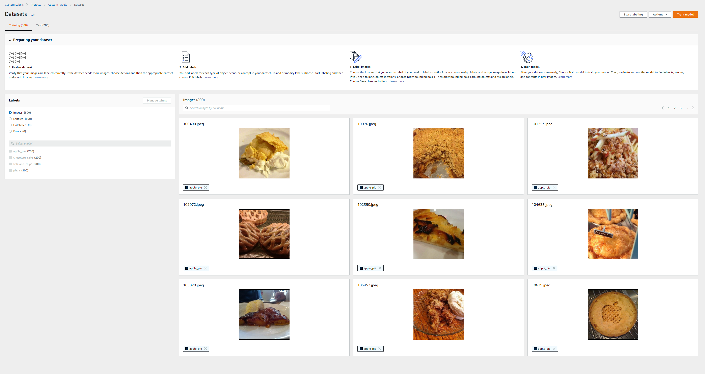
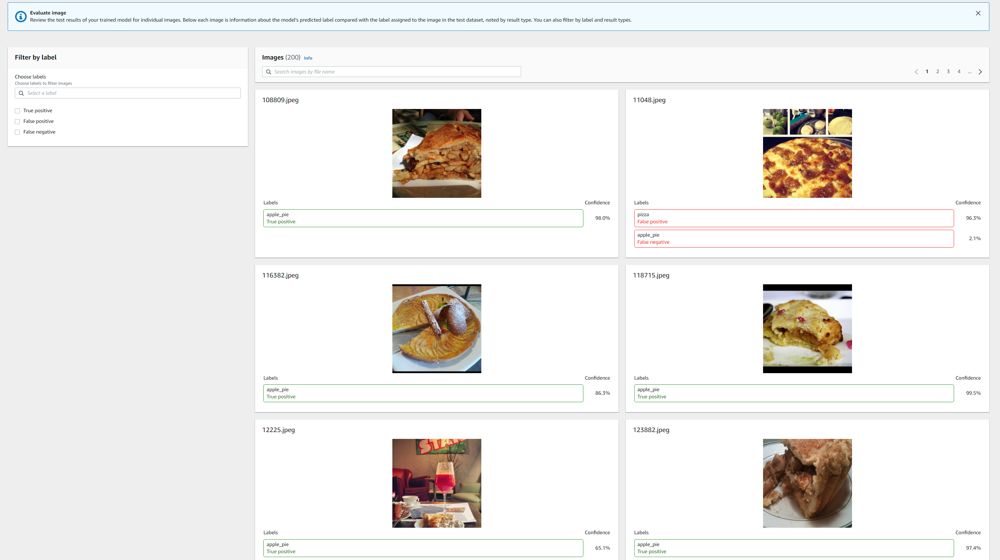
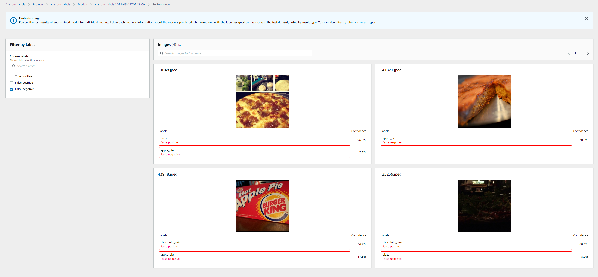

## AWS Rekognition

Rekognition is the AWS service for computer vision. It's capable of object detection, facial recognition and analysis, celebrity detection, text extraction, as well as detect any inappropriate 
content. It is a highly scalable service that requires no ML expertise to use. With Amazon Rekognition Custom Labels, you can identify the objects and scenes in images that are specific to 
your business needs. The following exercise, demonstrates using AWS Rekognition Custom Labels to train a custom labelled food images dataset  and then use the model to classify a set of test images.
All the scripts used in this exercise can be found in this [repo](https://github.com/ryankarlos/AWS-ML-services/projects/rekognition) and have been adapated from the [AWS docs](https://docs.aws.amazon.com/rekognition/latest/customlabels-dg/what-is.html)
for the use of these sample dataset in this exercise. To configure virtual environment follow the instructions [here](https://ryankarlos.github.io/AWS-ML-services/#environment-and-dependencies)

#### Uploading datatset to S3

Run the following command specifying the local path to image data tom upload, bucket name.
We also need to attach a resource policy to the bucket to give AWS Rekogniiton required
permissions to acccess bucket. We will run the following `transfer_data_s3.py` script located in this [folder](https://github.com/ryankarlos/AWS-ML-services/tree/master/s3) Pass the required resource policy filename 
We need to pass an arg `--policy_filename` to the script which is the filename of the s3 resource policy defined [here](https://github.com/ryankarlos/AWS-ML-services/blob/master/s3/resource_policies/rekognition_permissions.json)

```shell
$ python s3/transfer_data_s3.py --bucket_name rekognition-cv --local_dir datasets/food101 --policy_filename rekognition_permissions.json 
  
2022-05-15 00:46:40,095 botocore.credentials INFO:Found credentials in shared credentials file: ~/.aws/credentials
2022-05-15 00:46:40,698 __main__ INFO:Creating new bucket with name:rekognition-cv
2022-05-15 00:46:41,180 __main__ INFO:Creating bucket policy
0it [00:00, ?it/s]2022-05-15 00:46:41,212 __main__ INFO:Starting upload ....
0it [00:00, ?it/s]
2022-05-15 00:46:41,651 __main__ INFO:Successfully uploaded all image folders in ddatasets/cv/food101/food101_aws' to S3  bucket rekognition-cv
```

#### Creating project

A project manages the model versions, training dataset, and test dataset for a model. You can create a project with the Amazon Rekognition Custom Labels 
console or with the CreateProject API as described in the [docs](https://docs.aws.amazon.com/rekognition/latest/customlabels-dg/mp-create-project.html).
Run the following `create_project.py` script in the [project folder](https://github.com/ryankarlos/AWS-ML-services/projects/rekognition) 

```shell
$ python rekognition/creating_project.py custom_labels

INFO: Found credentials in shared credentials file: ~/.aws/credentials
INFO: Creating project: custom_labels
Creating project: custom_labels
Finished creating project: custom_labels
```

#### Creating dataset

This automatically splits the dataset into training and test.Alternatively one can also pass in existing test dataset
More details can be found in [AWS docs](https://docs.aws.amazon.com/rekognition/latest/customlabels-dg/md-create-dataset-existing-dataset-sdk.html
)




#### Training model


Once training is complete you can view the overall results and per label performance on AWS console


or also examine the  false positives/false negative images 


to be fair a lot of false negatives and positives are rubbish images which should have been filtered out or better processed 


### Run inference

We run the model inference on a set of unseen images, by running the following [script](https://github.com/ryankarlos/AWS-ML-services/blob/master/projects/rekognition/inference.py)
and substituing the values for model_arn, project_arn and path to set of test images to the respective args below.

```shell
$ python rekognition/inference.py --model_arn=<model-arn-value> --project_arn=<project-arn-value> --image=datasets/cv/food101/train
```

This should output the following in the terminal

```shell

INFO: Starting model
INFO: Status: RUNNING
INFO: Message: The model is running.
INFO: Finished starting model
INFO: Analysing random 10 samples of local images as --bucket arg not supplied
INFO: Analyzing local file: datasets\cv\food101\train\chocolate_cake\55122.jpg
INFO: Detected custom labels for datasets\cv\food101\train\chocolate_cake\55122.jpg: [{'Name': 'chocolate_cake', 'Confidence': 94.60199737548828}]
INFO: Analyzing local file: datasets\cv\food101\train\fish_and_chips\3399117.jpg
INFO: Detected custom labels for datasets\cv\food101\train\fish_and_chips\3399117.jpg: [{'Name': 'fish_and_chips', 'Confidence': 99.22799682617188}]
INFO: Analyzing local file: datasets\cv\food101\train\pizza\1681043.jpg
INFO: Detected custom labels for datasets\cv\food101\train\pizza\1681043.jpg: [{'Name': 'pizza', 'Confidence': 99.62699890136719}]
INFO: Analyzing local file: datasets\cv\food101\train\fish_and_chips\691890.jpg
INFO: Detected custom labels for datasets\cv\food101\train\fish_and_chips\691890.jpg: [{'Name': 'fish_and_chips', 'Confidence': 99.55400085449219}]
INFO: Analyzing local file: datasets\cv\food101\train\chocolate_cake\3417862.jpg
INFO: Detected custom labels for datasets\cv\food101\train\chocolate_cake\3417862.jpg: [{'Name': 'chocolate_cake', 'Confidence': 94.77300262451172}]
INFO: Analyzing local file: datasets\cv\food101\train\fish_and_chips\67185.jpg
INFO: Detected custom labels for datasets\cv\food101\train\fish_and_chips\67185.jpg: [{'Name': 'fish_and_chips', 'Confidence': 69.9949951171875}]
INFO: Analyzing local file: datasets\cv\food101\train\apple_pie\403084.jpg
INFO: Detected custom labels for datasets\cv\food101\train\apple_pie\403084.jpg: [{'Name': 'apple_pie', 'Confidence': 84.39299774169922}]
INFO: Analyzing local file: datasets\cv\food101\train\apple_pie\966595.jpg
INFO: Detected custom labels for datasets\cv\food101\train\apple_pie\966595.jpg: []
INFO: Analyzing local file: datasets\cv\food101\train\apple_pie\3829004.jpg
INFO: Detected custom labels for datasets\cv\food101\train\apple_pie\3829004.jpg: [{'Name': 'apple_pie', 'Confidence': 99.96099853515625}]
INFO: Analyzing local file: datasets\cv\food101\train\fish_and_chips\633730.jpg
INFO: Detected custom labels for datasets\cv\food101\train\fish_and_chips\633730.jpg: [{'Name': 'fish_and_chips', 'Confidence': 99.38700103759766}]
INFO: Model detected 9 out of 10 correctly
INFO: Model could not detect 1 images due to confidence below threshold 60
INFO: Stopping model:
INFO: Finished stopping model
Done...
```


### Cleanup resources

We can cleanup resources created in this example, using a [custom script](https://github.com/ryankarlos/AWS-ML-services/blob/master/projects/rekognition/cleanup_resources.py)
However, we cannot delete project directly as have to clean up datasets and model first.
So first get project and dataset-arns using aws-cli

```shell
$ aws rekognition describe-projects --project-name custom_labels
```

Then delete test and train datasets with each arn

```shell
$ python rekognition/cleanup_resources.py --resource=dataset --dataset_arn="<arn-value>"

INFO: Deleting dataset: <arn-value>
INFO: waiting for dataset deletion <arn-value>
INFO: dataset deleted: <arn-value>
INFO: dataset deleted: <arn-value>
INFO: Finished deleting dataset: <arn-value>
````

Use the project arn retrieved from the previous step to get the model-arn using the cli command below

```shell
aws rekognition describe-project-versions --project-arn="<arn-value>"
```

Then delete the model resource, running the custom script and passing in the resource value as `model`
and model-arn retrieved form the previous step

```shell 
$ python rekognition/cleanup_resources.py --resource=model --model_arn=<arn-value>

Are you sure you wany to delete model <arn-value> ?
Enter delete to delete your model: delete
INFO: Deleting model: <arn-value>
INFO: Deleting dataset: <arn-value>
```


Then run the custom script again to delete the project dataset, by passing in the resource value as `project`
and `project-arn`

```shell 
$ python rekognition/cleanup_resources.py --resource=project --project_arn=<arn-value>

INFO: Deleting project: 
INFO: project status: DELETING
INFO: waiting for project deletion 
INFO: project deleted: 5
INFO: Finished deleting project: 
```

Finally, we can run the custom script to delete selected resources in bucket or the entire bucket. If the entire bucket does not need to
be deleted, the `--resource_list` arg can be passed.

```shell
$ python s3/cleanup_resources.py --bucket_name=rekognition-cv

2022-03-17 01:15:41,602 botocore.credentials INFO:Found credentials in shared credentials file: ~/.aws/credentials
2022-03-17 01:15:41,787 __main__ INFO:Deleting all objects in S3 bucket rekognition-cv as resource key not provided
2022-03-17 01:15:46,606 __main__ INFO:Deleted bucket rekognition-cv
```