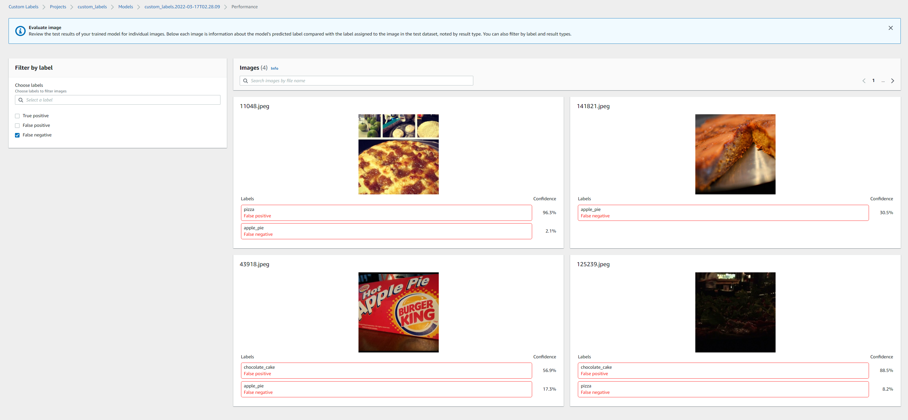

All the scripts in this folder using AWS SDK for python can be found in the official docs https://docs.aws.amazon.com/rekognition/latest/customlabels-dg/what-is.html
Some of these scripts have been adapted and tailored for the use of these sample datasets.

#### Creating project

https://docs.aws.amazon.com/rekognition/latest/customlabels-dg/mp-create-project.html

```
$ python rekognition/creating_project.py custom_labels
INFO: Found credentials in shared credentials file: ~/.aws/credentials
INFO: Creating project: custom_labels
Creating project: custom_labels
Finished creating project: custom_labels
```

#### Creating dataset

https://docs.aws.amazon.com/rekognition/latest/customlabels-dg/md-create-dataset-existing-dataset-sdk.html


This automatically splits the dataset into training and test.Alternatively one can also pass in existing test dataset


#### Training model


Once training is complete you can view the overall results and per label performance on AWS console


or also examine the  false positives/false negative images 


to be fair a lot of false negatives and positives are rubbish images which should have been filtered out or better processed 


### Run inference

```
$ python rekognition/inference.py --model_arn=<model-arn-value> --project_arn=<project-arn-value> --image=datasets/cv/food101/train
INFO: Starting model
INFO: Status: RUNNING
INFO: Message: The model is running.
INFO: Finished starting model
INFO: Analysing random 10 samples of local images as --bucket arg not supplied
INFO: Analyzing local file: datasets\cv\food101\train\chocolate_cake\55122.jpg
INFO: Detected custom labels for datasets\cv\food101\train\chocolate_cake\55122.jpg: [{'Name': 'chocolate_cake', 'Confidence': 94.60199737548828}]
INFO: Analyzing local file: datasets\cv\food101\train\fish_and_chips\3399117.jpg
INFO: Detected custom labels for datasets\cv\food101\train\fish_and_chips\3399117.jpg: [{'Name': 'fish_and_chips', 'Confidence': 99.22799682617188}]
INFO: Analyzing local file: datasets\cv\food101\train\pizza\1681043.jpg
INFO: Detected custom labels for datasets\cv\food101\train\pizza\1681043.jpg: [{'Name': 'pizza', 'Confidence': 99.62699890136719}]
INFO: Analyzing local file: datasets\cv\food101\train\fish_and_chips\691890.jpg
INFO: Detected custom labels for datasets\cv\food101\train\fish_and_chips\691890.jpg: [{'Name': 'fish_and_chips', 'Confidence': 99.55400085449219}]
INFO: Analyzing local file: datasets\cv\food101\train\chocolate_cake\3417862.jpg
INFO: Detected custom labels for datasets\cv\food101\train\chocolate_cake\3417862.jpg: [{'Name': 'chocolate_cake', 'Confidence': 94.77300262451172}]
INFO: Analyzing local file: datasets\cv\food101\train\fish_and_chips\67185.jpg
INFO: Detected custom labels for datasets\cv\food101\train\fish_and_chips\67185.jpg: [{'Name': 'fish_and_chips', 'Confidence': 69.9949951171875}]
INFO: Analyzing local file: datasets\cv\food101\train\apple_pie\403084.jpg
INFO: Detected custom labels for datasets\cv\food101\train\apple_pie\403084.jpg: [{'Name': 'apple_pie', 'Confidence': 84.39299774169922}]
INFO: Analyzing local file: datasets\cv\food101\train\apple_pie\966595.jpg
INFO: Detected custom labels for datasets\cv\food101\train\apple_pie\966595.jpg: []
INFO: Analyzing local file: datasets\cv\food101\train\apple_pie\3829004.jpg
INFO: Detected custom labels for datasets\cv\food101\train\apple_pie\3829004.jpg: [{'Name': 'apple_pie', 'Confidence': 99.96099853515625}]
INFO: Analyzing local file: datasets\cv\food101\train\fish_and_chips\633730.jpg
INFO: Detected custom labels for datasets\cv\food101\train\fish_and_chips\633730.jpg: [{'Name': 'fish_and_chips', 'Confidence': 99.38700103759766}]
INFO: Model detected 9 out of 10 correctly
INFO: Model could not detect 1 images due to confidence below threshold 60
INFO: Stopping model:
INFO: Finished stopping model
Done...
```


### Cleanup resources

Cannot delete project directly as hace to clean up datasets and model

* First get project and dataset-arns using aws-cli

```
$ aws rekognition describe-projects --project-name custom_labels
```

* Delete train and test datasets

* First get dataset-arn

```
$ aws rekognition describe-projects --project-name custom_labels
```

Then cleanup test and train datasets with each arn

```
$ python rekognition/cleanup_resources.py --resource=dataset --dataset_arn="<arn-value>"
INFO: Deleting dataset: <arn-value>
INFO: waiting for dataset deletion <arn-value>
INFO: dataset deleted: <arn-value>
INFO: dataset deleted: <arn-value>
INFO: Finished deleting dataset: <arn-value>


$ python rekognition/cleanup_resources.py --resource=dataset --dataset_arn=<arn-value>
INFO: Deleting dataset: <arn-value>
INFO: waiting for dataset deletion <arn-value>
INFO: dataset deleted: <arn-value>
INFO: dataset deleted: <arn-value>
INFO: Finished deleting dataset: <arn-value>

```

* Delete model

Get model-arn
```
aws rekognition describe-project-versions --project-arn="<arn-value>"
```

and use arn to delete model 

```
$ python rekognition/cleanup_resources.py --resource=model --model_arn=<arn-value>
Are you sure you wany to delete model <arn-value> ?
Enter delete to delete your model: delete
INFO: Deleting model: <arn-value>
INFO: Deleting dataset: <arn-value>
```


* Then delete project dataset

```
$ python rekognition/cleanup_resources.py --resource=project --project_arn=<arn-value>
INFO: Deleting project: 
INFO: project status: DELETING
INFO: waiting for project deletion 
INFO: project deleted: 5
INFO: Finished deleting project: 
```