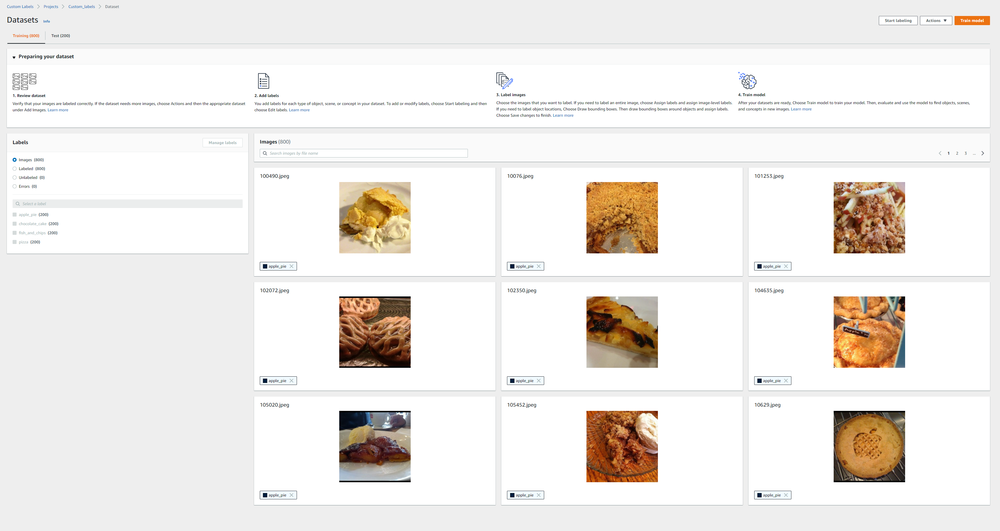
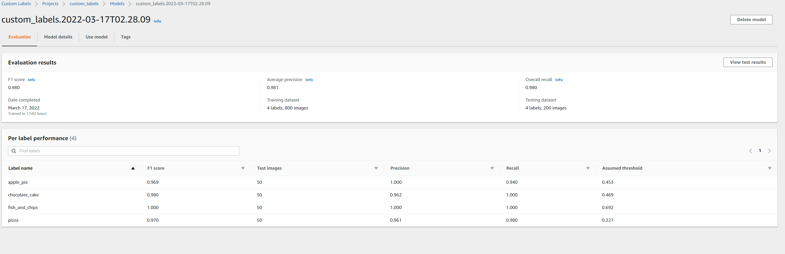
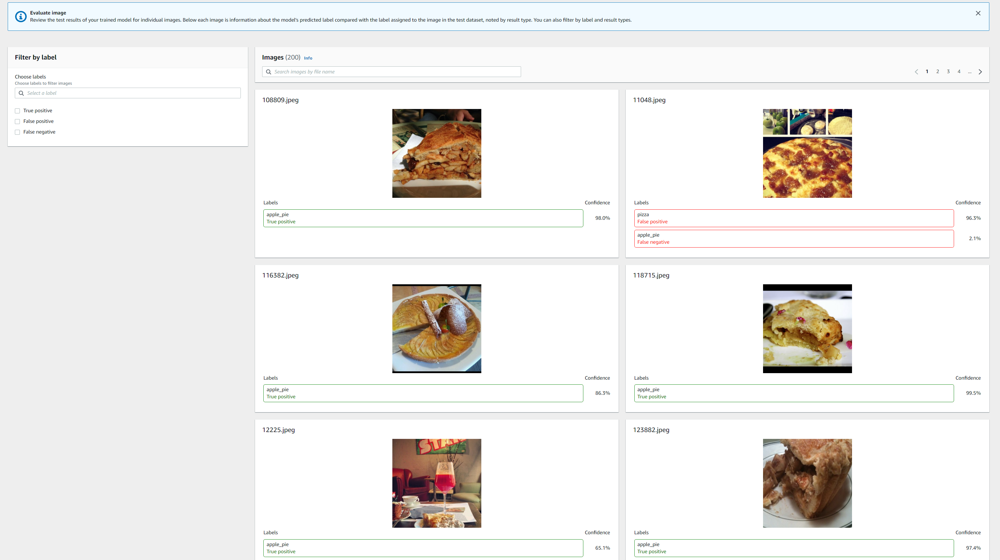

All the scripts in this folder using AWS SDK for python can be found in the official docs https://docs.aws.amazon.com/rekognition/latest/customlabels-dg/what-is.html
Some of these scripts have been adapted and tailored for the use of these sample datasets.

#### Creating project

https://docs.aws.amazon.com/rekognition/latest/customlabels-dg/mp-create-project.html

```
$ python rekognition/creating_project.py custom_labels
INFO: Found credentials in shared credentials file: ~/.aws/credentials
INFO: Creating project: custom_labels
Creating project: custom_labels
Finished creating project: custom_labels
```

#### Creating dataset

https://docs.aws.amazon.com/rekognition/latest/customlabels-dg/md-create-dataset-existing-dataset-sdk.html


This automatically splits the dataset into training and test.Alternatively one can also pass in existing test dataset




#### Training model


Once training is complete you can view the overall results and per label performance on AWS console



or also examine the  false positives/false negative images 


### Run inference

```
$ python rekognition/inference.py --model_arn=<model-arn-value> --project_arn=<project-arn-value> --image=datasets/cv/food101/train
INFO: Analysing random 10 samples of local images as --bucket arg not supplied
INFO: Analyzing local file: datasets\cv\food101\train\fish_and_chips\3118637.jpg
INFO: Detected custom labels for datasets\cv\food101\train\fish_and_chips\3118637.jpg: [{'Name': 'fish_and_chips', 'Confidence': 94.93600463867188}]
INFO: Analyzing local file: datasets\cv\food101\train\apple_pie\2574026.jpg
INFO: Detected custom labels for datasets\cv\food101\train\apple_pie\2574026.jpg: [{'Name': 'apple_pie', 'Confidence': 99.52099609375}]
INFO: Analyzing local file: datasets\cv\food101\train\pizza\774142.jpg
INFO: Detected custom labels for datasets\cv\food101\train\pizza\774142.jpg: [{'Name': 'pizza', 'Confidence': 99.80699920654297}]
INFO: Analyzing local file: datasets\cv\food101\train\fish_and_chips\2294935.jpg
INFO: Detected custom labels for datasets\cv\food101\train\fish_and_chips\2294935.jpg: [{'Name': 'fish_and_chips', 'Confidence': 98.91999816894531}]
INFO: Analyzing local file: datasets\cv\food101\train\fish_and_chips\23929.jpg
INFO: Detected custom labels for datasets\cv\food101\train\fish_and_chips\23929.jpg: [{'Name': 'fish_and_chips', 'Confidence': 98.41600036621094}]
INFO: Analyzing local file: datasets\cv\food101\train\fish_and_chips\990368.jpg
INFO: Detected custom labels for datasets\cv\food101\train\fish_and_chips\990368.jpg: [{'Name': 'fish_and_chips', 'Confidence': 97.91100311279297}]
INFO: Analyzing local file: datasets\cv\food101\train\fish_and_chips\2339438.jpg
INFO: Detected custom labels for datasets\cv\food101\train\fish_and_chips\2339438.jpg: [{'Name': 'fish_and_chips', 'Confidence': 98.92399597167969}]
INFO: Analyzing local file: datasets\cv\food101\train\fish_and_chips\3513087.jpg
INFO: Detected custom labels for datasets\cv\food101\train\fish_and_chips\3513087.jpg: [{'Name': 'fish_and_chips', 'Confidence': 99.6510009765625}]
INFO: Analyzing local file: datasets\cv\food101\train\apple_pie\1340287.jpg
INFO: Detected custom labels for datasets\cv\food101\train\apple_pie\1340287.jpg: [{'Name': 'chocolate_cake', 'Confidence': 61.297000885009766}]
INFO: Analyzing local file: datasets\cv\food101\train\fish_and_chips\674163.jpg
INFO: Detected custom labels for datasets\cv\food101\train\fish_and_chips\674163.jpg: [{'Name': 'fish_and_chips', 'Confidence': 99.18800354003906}]
INFO: Model detected 9 out of 10 correctly
INFO: Model could not detect 0 images due to confidence below threshold 60

```